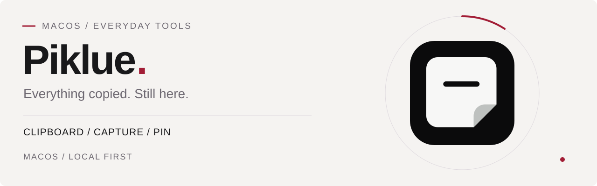

**English** &nbsp; / &nbsp; [简体中文](https://github.com/soBigRice)

# soBigRice

**Independent developer / Self-taught builder / MiaoBoss’s employee_001**

From web graphics and desktop tools to round displays and in-car integrations. I turn curiosity into things that work, refining the interface, the code and the real device together.

[Personal website ↗](https://sobigrice.com) &nbsp; / &nbsp; [Piklue website ↗](https://piklue.miaozong.cc/) &nbsp; / &nbsp; [MiaoBoss’s office ↗](https://www.miaozong.cc/) &nbsp; / &nbsp; [Tech blog ↗](https://blog.sobigrice.com) &nbsp; / &nbsp; [All repositories ↗](https://github.com/soBigRice?tab=repositories) &nbsp; / &nbsp; [npm ↗](https://www.npmjs.com/package/cesium.path)

## 01 / Public Signals

<picture>
  <source media="(prefers-color-scheme: dark)" srcset="./assets/profile-signals-dark.svg" />
  
</picture>

<!-- PROFILE:snapshot:START -->
Data snapshot: **2026-10-07** · Public information only · Dates use UTC+8. Metric scopes are noted below each chart and table.
<!-- PROFILE:snapshot:END -->

<!-- PROFILE:account:START -->
| Metric | Data | Scope |
| --- | --- | --- |
| Public repositories | 32 | Non-fork 23 / Fork 9 |
| Stars / forks received | 12 / 3 | All public repositories owned by this account, including forks and adaptations |
| Followers / following | 3 / 3 | Public GitHub account data |
| Public gists | 0 | Public code snippets |
| Joined GitHub | 2020-04-10 | Account creation date |
| Languages in non-fork repositories | 15 | Detected by GitHub Linguist; excludes forks |
| Public releases | 51 | Includes pre-releases; excludes drafts |
| Release asset downloads | 192 | GitHub asset downloads only; excludes OTA, mirrors and npm |
<!-- PROFILE:account:END -->

### Contributions / Non-fork Repositories / Commit Times

<picture>
  <source media="(prefers-color-scheme: dark)" srcset="https://github-profile-summary-cards.vercel.app/api/cards/profile-details?username=soBigRice&amp;theme=radical&amp;animation=draw&amp;duration=2&amp;utcOffset=8&amp;bg_color=111018&amp;title_color=ff537c&amp;text_color=dae1ef&amp;border_color=30263f&amp;icon_color=48ead3&amp;chart_color=ff537c" />
  
</picture>

  <picture>
    <source media="(prefers-color-scheme: dark)" srcset="https://github-profile-summary-cards.vercel.app/api/cards/stats?username=soBigRice&amp;theme=radical&amp;animation=draw&amp;duration=2&amp;utcOffset=8&amp;bg_color=111018&amp;title_color=ff537c&amp;text_color=dae1ef&amp;border_color=30263f&amp;icon_color=48ead3&amp;chart_color=ff537c" />
    
  </picture>
  <picture>
    <source media="(prefers-color-scheme: dark)" srcset="https://github-profile-summary-cards.vercel.app/api/cards/productive-time?username=soBigRice&amp;theme=radical&amp;animation=draw&amp;duration=2&amp;utcOffset=8&amp;bg_color=111018&amp;title_color=ff537c&amp;text_color=dae1ef&amp;border_color=30263f&amp;icon_color=48ead3&amp;chart_color=ff537c" />
    
  </picture>

Dynamic cards are provided by GitHub Profile Summary Cards using public data and a service cache. Their repository and star counts exclude forks; the API snapshot above includes forks. Commits, pull requests, issues and contributions are different metrics and should not be added together.

## 02 / Recent Builds

### [Piklue](https://piklue.miaozong.cc/) · Everything copied. Still here.

<a href="https://piklue.miaozong.cc/">
  <picture>
    <source media="(prefers-color-scheme: dark)" srcset="./assets/project-piklue-dark.svg" />
    
  </picture>
</a>

A **macOS clipboard tool** I built to keep text, links, images, files and screenshots within reach. Open it with a keyboard shortcut, search and reuse what you copied. Annotate screenshots or pin images, text and colors on screen as a handy reference. Your content stays on your Mac.

`macOS` · `Clipboard history` · `Screenshot annotation` · `On-screen pins` · `Local storage`

**[Visit Piklue ↗](https://piklue.miaozong.cc/)** &nbsp; / &nbsp; [Explore features](https://piklue.miaozong.cc/#features) &nbsp; / &nbsp; [Support & guides](https://piklue.miaozong.cc/support)

 

### [soRound OS](https://github.com/soBigRice/soRound_os) · A small screen. A whole world.

<a href="https://sobigrice.github.io/soRound_os/">
  <picture>
    <source media="(prefers-color-scheme: dark)" srcset="./assets/project-soround-dark.svg" />
    
  </picture>
</a>

A lightweight system for a **1.75-inch round AMOLED**: watch faces, weather, audio visualization, mini-games, BLE controls, a digital twin and dual-slot OTA updates. Hardware, firmware and web interactions evolve together.

`ESP32-S3` · `C` · `ESP-IDF` · `LVGL` · `Three.js`

**[Visit the project ↗](https://sobigrice.github.io/soRound_os/)** &nbsp; / &nbsp; [Source code](https://github.com/soBigRice/soRound_os) &nbsp; / &nbsp; [Firmware & releases](https://github.com/soBigRice/soRound_os/releases)

 

### [LynkCo-DiPlay](https://github.com/soBigRice/LynkCo-DiPlay) · A better connection, in your car.

<a href="https://sobigrice.github.io/LynkCo-DiPlay/">
  <picture>
    <source media="(prefers-color-scheme: dark)" srcset="./assets/project-lynkco-dark.svg" />
    
  </picture>
</a>

A CarPlay adaptation for Lynk & Co head units, based on **[DiPlay](https://github.com/shihabal3amri/DiPlay)**. It focuses on connection recovery, interface refinements and diagnostics for Android 9.

`Kotlin` · `Android 9` · `Lynk OS N 2.0` · `CarPlay`

**[Explore the project ↗](https://sobigrice.github.io/LynkCo-DiPlay/)** &nbsp; / &nbsp; [Source code](https://github.com/soBigRice/LynkCo-DiPlay) &nbsp; / &nbsp; [Compatibility & build guide](https://github.com/soBigRice/LynkCo-DiPlay/blob/main/README.md)

An independent adaptation with upstream credits retained. Wired connectivity has been tested in a real vehicle; wireless still awaits validation. The source is public, but a complete APK has not been published. See the project documentation for the current support scope.

 

## 03 / Languages & Stack

<picture>
  <source media="(prefers-color-scheme: dark)" srcset="https://github-profile-summary-cards.vercel.app/api/cards/most-commit-language?username=soBigRice&amp;theme=radical&amp;animation=draw&amp;duration=2&amp;utcOffset=8&amp;bg_color=111018&amp;title_color=ff537c&amp;text_color=dae1ef&amp;border_color=30263f&amp;icon_color=48ead3&amp;chart_color=ff537c" />
  
</picture>

**Language distribution in non-fork repositories** · The table uses GitHub Linguist byte counts across my public non-fork repositories. It describes repository contents, including any bundled third-party code; it does not measure lines I personally wrote or rank my proficiency.

<!-- PROFILE:languages:START -->
| Language | Code bytes | Share | Non-fork repositories |
| --- | --- | --- | --- |
| C | 13,020,039 | 61.42% | 3 |
| JavaScript | 5,564,071 | 26.25% | 15 |
| HTML | 1,404,367 | 6.62% | 15 |
| TypeScript | 342,509 | 1.62% | 10 |
| Swift | 283,383 | 1.34% | 2 |
| CSS | 156,783 | 0.74% | 13 |
| Rust | 114,038 | 0.54% | 1 |
| C++ | 107,768 | 0.51% | 2 |
| Python | 80,366 | 0.38% | 1 |
| Vue | 66,410 | 0.31% | 2 |
| GLSL | 27,134 | 0.13% | 2 |
| CMake | 18,549 | 0.09% | 1 |
| Shell | 11,281 | 0.05% | 2 |
| Dockerfile | 1,618 | 0.01% | 3 |
| Batchfile | 293 | 0.00% | 1 |
<!-- PROFILE:languages:END -->

| Area | Technologies & tools | Projects |
| --- | --- | --- |
| Web & graphics | TypeScript / JavaScript / Vue / React / Three.js / GLSL / WebGL / WebGPU / Cesium | Three Shader Example / cesium.path / Hello WebGPU / AR & XR |
| Desktop tools | Rust / Tauri / Swift / macOS / Windows | Piklue / Port Guardian / oh-fans / ohBangs |
| Embedded & interaction | C / ESP32-S3 / ESP-IDF / LVGL / AMOLED / E-Ink / BLE | soRound OS / WiFi Calendar |
| Automotive integration | Kotlin / Android 9 / Lynk OS N 2.0 / CarPlay | LynkCo-DiPlay · based on DiPlay |
| Backend & delivery | Node.js / Git / GitHub Actions | API Cache / Lsky Server / NodeMessage / Firmware releases |

## 04 / Project Atlas · All Non-fork Repositories

Public non-fork repositories, sorted by last push. Dates use UTC+8. `★` Stars · `⑂` Forks · `Open` Open issues and pull requests combined, as reported by GitHub. Undetected languages and licenses are marked explicitly. Wide tables can be scrolled horizontally on mobile.

<!-- PROFILE:original:START -->
| Project | Focus & description | Main languages | Data | Last push | License | Links |
| --- | --- | --- | --- | --- | --- | --- |
| [soRound_os](https://github.com/soBigRice/soRound_os) | **Embedded systems** A lightweight system for the Waveshare 1.75-inch round capacitive-touch AMOLED development board. | C / Python / HTML | ★ 0 ⑂ 0 Open 0 | 2026-10-07 | Not detected | [Source](https://github.com/soBigRice/soRound_os) · [Visit](https://sobigrice.github.io/soRound_os/) · [Releases](https://github.com/soBigRice/soRound_os/releases) |
| [soBigRice](https://github.com/soBigRice/soBigRice) | **Profile** My GitHub profile and personal introduction. | Not detected | ★ 0 ⑂ 0 Open 0 | 2026-10-07 | Not detected | [Source](https://github.com/soBigRice/soBigRice) |
| [port-guardian](https://github.com/soBigRice/port-guardian) | **Desktop tools** A port and process management tool for macOS and Windows. | Rust / TypeScript / CSS | ★ 4 ⑂ 0 Open 0 | 2026-07-03 | Not detected | [Source](https://github.com/soBigRice/port-guardian) · [Releases](https://github.com/soBigRice/port-guardian/releases) |
| [three_shader_example](https://github.com/soBigRice/three_shader_example) | **Graphics experiments** A collection of Three.js shader examples built through vibe coding. | TypeScript / GLSL / CSS | ★ 0 ⑂ 0 Open 0 | 2026-05-15 | Not detected | [Source](https://github.com/soBigRice/three_shader_example) · [Visit](https://sobigrice.github.io/three_shader_example/) |
| [ohBangs](https://github.com/soBigRice/ohBangs) | **Desktop interaction** A Dynamic Island-style interface for macOS. | Not detected | ★ 0 ⑂ 0 Open 0 | 2026-05-04 | MIT | [Source](https://github.com/soBigRice/ohBangs) |
| [oh-fans](https://github.com/soBigRice/oh-fans) | **Desktop tools** A fan utility I built for macOS. | Swift / Shell / C | ★ 0 ⑂ 0 Open 0 | 2026-04-27 | Not detected | [Source](https://github.com/soBigRice/oh-fans) · [Visit](https://github.com/soBigRice/oh-fans/releases/latest) · [Releases](https://github.com/soBigRice/oh-fans/releases) |
| [-API-](https://github.com/soBigRice/-API-) | **Backend services** An API collection with local caching for services with limited free requests or infrequent updates. | TypeScript / JavaScript / Dockerfile | ★ 0 ⑂ 0 Open 0 | 2026-03-26 | Not detected | [Source](https://github.com/soBigRice/-API-) |
| [lsky_v2.1_node_server](https://github.com/soBigRice/lsky_v2.1_node_server) | **Backend services** A Node.js service for the open-source Lsky Pro v2.1 image hosting platform. | JavaScript / Dockerfile | ★ 0 ⑂ 0 Open 0 | 2026-03-23 | MIT | [Source](https://github.com/soBigRice/lsky_v2.1_node_server) |
| [snapshot](https://github.com/soBigRice/snapshot) | **Game experiments** A simple shooting game. | TypeScript / CSS / JavaScript | ★ 0 ⑂ 0 Open 0 | 2026-03-06 | MIT | [Source](https://github.com/soBigRice/snapshot) · [Visit](https://sobigrice.github.io/snapshot/) |
| [WebGL_heart_beat](https://github.com/soBigRice/WebGL_heart_beat) | **Graphics experiments** A WebGL heartbeat template. | Vue / TypeScript / GLSL | ★ 0 ⑂ 0 Open 0 | 2026-03-06 | Not detected | [Source](https://github.com/soBigRice/WebGL_heart_beat) · [Visit](https://sobigrice.github.io/WebGL_heart_beat/) · [Releases](https://github.com/soBigRice/WebGL_heart_beat/releases) |
| [wifiCalendar](https://github.com/soBigRice/wifiCalendar) | **Embedded devices** A smart Wi-Fi calendar built with ESP32 and an e-ink display. | C / C++ | ★ 0 ⑂ 0 Open 0 | 2026-03-02 | Not detected | [Source](https://github.com/soBigRice/wifiCalendar) |
| [graphical.top](https://github.com/soBigRice/graphical.top) | **Graphics resources** Additional content for graphical.top. | Vue / CSS / HTML | ★ 0 ⑂ 0 Open 0 | 2026-02-14 | Not detected | [Source](https://github.com/soBigRice/graphical.top) |
| [github_action_server](https://github.com/soBigRice/github_action_server) | **Developer tools** A service for GitHub Actions. | JavaScript | ★ 0 ⑂ 0 Open 0 | 2026-02-14 | Not detected | [Source](https://github.com/soBigRice/github_action_server) |
| [Hello-WebGPU](https://github.com/soBigRice/Hello-WebGPU) | **Graphics experiments** A WebGPU welcome page using WGSL shaders. | JavaScript / HTML / CSS | ★ 0 ⑂ 0 Open 0 | 2026-01-29 | Not detected | [Source](https://github.com/soBigRice/Hello-WebGPU) |
| [NodeMessage](https://github.com/soBigRice/NodeMessage) | **Backend services** A Node.js notification service that delivers messages by email. | JavaScript / Shell / Dockerfile | ★ 0 ⑂ 0 Open 0 | 2025-07-09 | ISC | [Source](https://github.com/soBigRice/NodeMessage) |
| [Cesium.path](https://github.com/soBigRice/Cesium.path) | **Graphics components** — | JavaScript / CSS / HTML | ★ 0 ⑂ 1 Open 0 | 2025-05-12 | MIT | [Source](https://github.com/soBigRice/Cesium.path) |
| [fpsActor](https://github.com/soBigRice/fpsActor) | **Game experiments** — | TypeScript / CSS / HTML | ★ 0 ⑂ 0 Open 0 | 2025-05-10 | Not detected | [Source](https://github.com/soBigRice/fpsActor) · [Visit](https://sobigrice.github.io/fpsActor/) |
| [old_github_io](https://github.com/soBigRice/old_github_io) | **Tool collection** An ambitious collection of tools, built one piece at a time. | HTML / JavaScript / CSS | ★ 0 ⑂ 1 Open 0 | 2024-11-14 | MIT | [Source](https://github.com/soBigRice/old_github_io) |
| [ar_view](https://github.com/soBigRice/ar_view) | **AR experiments** a sample demo for show WebAR by Three.js | JavaScript / HTML / CSS | ★ 0 ⑂ 0 Open 0 | 2024-11-13 | Not detected | [Source](https://github.com/soBigRice/ar_view) · [Visit](https://ar-view.vercel.app) |
| [npm-library-universal-template](https://github.com/soBigRice/npm-library-universal-template) | **Developer templates** — | TypeScript / HTML / JavaScript | ★ 0 ⑂ 0 Open 0 | 2024-06-05 | MIT | [Source](https://github.com/soBigRice/npm-library-universal-template) |
| [guigui267.github.io](https://github.com/soBigRice/guigui267.github.io) | **Early website** My first experimental website on GitHub. | HTML / CSS / JavaScript | ★ 0 ⑂ 0 Open 0 | 2023-02-22 | Not detected | [Source](https://github.com/soBigRice/guigui267.github.io) |
| [3Ddemo](https://github.com/soBigRice/3Ddemo) | **Graphics components** A simple 3D website with reusable Three.js scene components. | JavaScript / HTML | ★ 0 ⑂ 0 Open 0 | 2021-11-18 | Not detected | [Source](https://github.com/soBigRice/3Ddemo) |
| [Graduation-project-WebXR](https://github.com/soBigRice/Graduation-project-WebXR) | **XR experiments** — | JavaScript / CSS / HTML | ★ 0 ⑂ 0 Open 0 | 2021-05-14 | Not detected | [Source](https://github.com/soBigRice/Graduation-project-WebXR) |
<!-- PROFILE:original:END -->

## 05 / Built on Open Source · Forks & Adaptations

Includes the Lynk & Co adaptation in development and my other public forks. Fork relationships are identified by GitHub. See each repository for original authors, upstream licenses and scope.

<!-- PROFILE:forks:START -->
| Project | Focus & description | Main languages | Data | Last push | License | Links |
| --- | --- | --- | --- | --- | --- | --- |
| [LynkCo-DiPlay](https://github.com/soBigRice/LynkCo-DiPlay) | **Lynk & Co adaptation** CarPlay compatibility for Lynk &amp; Co OS N. | Kotlin / HTML / C | ★ 8 ⑂ 1 Open 0 | 2026-10-07 | GPL-3.0 | [Source](https://github.com/soBigRice/LynkCo-DiPlay) · [Visit](https://soBigRice.github.io/LynkCo-DiPlay/) |
| [three.path](https://github.com/soBigRice/three.path) | **Fork** three.path is a three.js extension which provides a 3D path geometry builder. | JavaScript | ★ 0 ⑂ 0 Open 0 | 2024-12-04 | MIT | [Source](https://github.com/soBigRice/three.path) |
| [AR.js](https://github.com/soBigRice/AR.js) | **Fork** Image tracking, Location Based AR, Marker tracking. All on the Web. | JavaScript / HTML / Brainfuck | ★ 0 ⑂ 0 Open 0 | 2024-11-13 | MIT | [Source](https://github.com/soBigRice/AR.js) |
| [load-bmfont](https://github.com/soBigRice/load-bmfont) | **Fork** loads a BMFont file in Node and the browser | JavaScript | ★ 0 ⑂ 0 Open 0 | 2024-10-31 | MIT | [Source](https://github.com/soBigRice/load-bmfont) |
| [aliyundrive-checkin](https://github.com/soBigRice/aliyundrive-checkin) | **Fork** An automatic daily check-in utility for Aliyun Drive. | Python | ★ 0 ⑂ 0 Open 0 | 2024-04-07 | Not detected | [Source](https://github.com/soBigRice/aliyundrive-checkin) |
| [extend_three.js](https://github.com/soBigRice/extend_three.js) | **Fork** JavaScript 3D Library. | JavaScript / HTML / Roff | ★ 0 ⑂ 0 Open 0 | 2023-08-10 | MIT | [Source](https://github.com/soBigRice/extend_three.js) · [Visit](https://threejs.org/) |
| [lodash-utils](https://github.com/soBigRice/lodash-utils) | **Fork** Based on evil.js; can be used like lodash, but intentionally causes errors under certain conditions. | JavaScript | ★ 0 ⑂ 0 Open 0 | 2022-08-25 | MIT | [Source](https://github.com/soBigRice/lodash-utils) |
| [three-bmfont-text](https://github.com/soBigRice/three-bmfont-text) | **Fork** renders BMFont files in ThreeJS with word-wrapping | JavaScript / GLSL / HTML | ★ 0 ⑂ 0 Open 0 | 2022-07-25 | MIT | [Source](https://github.com/soBigRice/three-bmfont-text) · [Visit](http://jam3.github.io/three-bmfont-text/test/) |
| [metaverse](https://github.com/soBigRice/metaverse) | **Fork** metaverse | TypeScript / JavaScript / HTML | ★ 0 ⑂ 0 Open 0 | 2021-12-17 | Not detected | [Source](https://github.com/soBigRice/metaverse) |
<!-- PROFILE:forks:END -->

## 06 / Shipping Log · Releases & Downloads

Public releases and asset downloads from repositories owned by this account. Includes pre-releases and excludes drafts. Downloads do not represent device counts. OTA, mirrors and npm downloads outside GitHub are not included.

<!-- PROFILE:releases:START -->
| Project | Latest stable | Latest release | Release count | Total asset downloads | Last release date |
| --- | --- | --- | --- | --- | --- |
| [soRound_os](https://github.com/soBigRice/soRound_os) | [v1.6.1](https://github.com/soBigRice/soRound_os/releases/tag/v1.6.1) | [v1.7-beta.29](https://github.com/soBigRice/soRound_os/releases/tag/v1.7-beta.29) · pre-release | 34 | 28 | 2026-10-07 |
| [port-guardian](https://github.com/soBigRice/port-guardian) | [v0.2.10](https://github.com/soBigRice/port-guardian/releases/tag/v0.2.10) | [v0.2.10](https://github.com/soBigRice/port-guardian/releases/tag/v0.2.10) | 14 | 149 | 2026-07-03 |
| [oh-fans](https://github.com/soBigRice/oh-fans) | [v1.0.1](https://github.com/soBigRice/oh-fans/releases/tag/v1.0.1) | [v1.0.1](https://github.com/soBigRice/oh-fans/releases/tag/v1.0.1) | 2 | 15 | 2026-04-24 |
| [WebGL_heart_beat](https://github.com/soBigRice/WebGL_heart_beat) | [v1.0.0](https://github.com/soBigRice/WebGL_heart_beat/releases/tag/v1.0.0) | [v1.0.0](https://github.com/soBigRice/WebGL_heart_beat/releases/tag/v1.0.0) | 1 | 0 | 2026-03-06 |
<!-- PROFILE:releases:END -->

## 07 / Keep Building

<picture>
  <source media="(prefers-color-scheme: light)" srcset="https://raw.githubusercontent.com/soBigRice/soBigRice/output/github-snake.svg" />
  
</picture>

I started teaching myself to code in 2020. I keep building tools, experimenting with graphics and tinkering with small devices — and revisiting the things that could be better.

---

**MiaoBoss handles the review. I handle the next commit.**

[soBigRice](https://github.com/soBigRice) &nbsp; · &nbsp; [miaozong.cc](https://www.miaozong.cc/) &nbsp; · &nbsp; [sobigrice.com](https://sobigrice.com)

