<div align="center">

<picture>
  <source media="(prefers-color-scheme: light)" srcset="./assets/hero-terminal-light.svg" />
  
</picture>

<p>
  <a href="https://blog.sobigrice.com"></a>
  <a href="https://sobigrice.com"></a>
  <a href="https://www.npmjs.com/package/cesium.path"></a>
  
  
</p>

</div>

---

## `$ cat about.md`

> 你好,我是 **米大饭 / soBigRice** —— 一个没科班出身、纯靠好奇心上桌的**自学型开发者**。

这一碗饭,从 `2020` 年开始熬,到现在还在小火慢炖 🍚。
我不太挑食:**网页里的图形**、**桌面上的小工具**、**桌子上的硬件** —— 哪个香就夹哪个。

```diff
+ 端口被进程占着不肯走?  我一勺端了它          → port-guardian
+ Mac 风扇半夜嗷嗷叫?     我亲自上手吹给你听      → oh-fans
+ Mac 的刘海空着也是空着?  顺手给它整个灵动岛      → ohBangs
+ 墙上的日历不会看天气?    塞块 ESP32 进去就会了    → wifiCalendar
```

做完项目,我还有个习惯:把踩过的坑、想明白的思路、能复用的方案,都写成字丢到博客里。
所以这个主页不只是项目索引,也是一份公开的技术笔记入口。

> **人生如戏,我负责加戏。** 代码能跑就行,跑得好看,更妙。

---

## `$ ls -la ~/projects`

> 挑几道刚出锅 / 还热乎的端上来,剩下的在锅里(往下点开)。

<table>
<tr>
<td width="50%" valign="top">

**[`port-guardian`](https://github.com/soBigRice/port-guardian)** &nbsp; 

端口被进程占着不放?**一勺端了它** 🥄
跨平台(Mac / Windows)的端口进程管理工具。

[`源码 ↗`](https://github.com/soBigRice/port-guardian)

</td>
<td width="50%" valign="top">

**[`three_shader_example`](https://github.com/soBigRice/three_shader_example)** &nbsp; 

一柜子 Three.js 的 shader,边 `vibecoding` 边攒出来的视觉小馆子。

[`源码 ↗`](https://github.com/soBigRice/three_shader_example) · [`▶ 在线玩`](https://sobigrice.github.io/three_shader_example/)

</td>
</tr>
<tr>
<td width="50%" valign="top">

**[`oh-fans`](https://github.com/soBigRice/oh-fans)** &nbsp; 

嫌 Mac 风扇吵?**我亲手吹给你听** 🌀
自己写的 macOS 风扇控制软件。

[`源码 ↗`](https://github.com/soBigRice/oh-fans) · [`⬇ 下载`](https://github.com/soBigRice/oh-fans/releases/latest)

</td>
<td width="50%" valign="top">

**[`ohBangs`](https://github.com/soBigRice/ohBangs)** &nbsp; 

刘海空着也是空着 —— **给 Mac 也整个灵动岛**,让它支棱起来。

[`源码 ↗`](https://github.com/soBigRice/ohBangs)

</td>
</tr>
<tr>
<td width="50%" valign="top">

**[`wifiCalendar`](https://github.com/soBigRice/wifiCalendar)** &nbsp; 

`ESP32` + 墨水屏,一块**会联网、会看天气**的桌面日历。带点硬件味儿。

[`源码 ↗`](https://github.com/soBigRice/wifiCalendar)

</td>
<td width="50%" valign="top">

**[`cesium.path`](https://www.npmjs.com/package/cesium.path)** &nbsp; 

已上架 `npm` 的 Cesium 路径能力库,专治飞行轨迹与路径动画。

[`npm ↗`](https://www.npmjs.com/package/cesium.path) · [`源码 ↗`](https://github.com/soBigRice/Cesium.path)

</td>
</tr>
</table>

<details>
<summary><b>&nbsp;🍚 <code>$ ls --all</code> &nbsp;锅里还有这些 —— 点开看看</b></summary>

<br/>

| 项目 | 这是个啥 | 去哪看 |
| --- | --- | --- |
| `snapshot` | 手痒做的射击小游戏,瞄准、开火、就完事了 | [源码](https://github.com/soBigRice/snapshot) · [▶ 玩](https://sobigrice.github.io/snapshot/) |
| `WebGL_heart_beat` | 一颗用 WebGL 砰砰跳动的心脏模版 | [源码](https://github.com/soBigRice/WebGL_heart_beat) · [▶ 看](https://sobigrice.github.io/WebGL_heart_beat/) |
| `fpsActor` | 第一人称视角的小角色操控实验 | [源码](https://github.com/soBigRice/fpsActor) · [▶ 看](https://sobigrice.github.io/fpsActor/) |
| `Hello-WebGPU` | 用 `WGSL` 写的 WebGPU 见面礼,给新 API 递杯茶 | [源码](https://github.com/soBigRice/Hello-WebGPU) |
| `-API-` | 把「免费但不实时」的接口缓存到本地的接口合集 | [源码](https://github.com/soBigRice/-API-) |
| `lsky_v2.1_node_server` | 基于兰空图床 v2.1 的 Node.js 服务实现 | [源码](https://github.com/soBigRice/lsky_v2.1_node_server) |
| `NodeMessage` | Node 写的消息通知服务,把动静直送你邮箱 | [源码](https://github.com/soBigRice/NodeMessage) |

</details>

---

## `$ neofetch`

```text
              ) ) )
             ( ( (                 soBigRice@github
          .===========.           ───────────────────────────────────
          |  米 大 饭  | 🍚        OS      :  macOS · Windows · ESP32
          '==.       .=='         Host    :  自学型开发者 (self-taught)
             '======='            Uptime  :  熬饭 since 2020.04
                                  Shell   :  zsh + 一点点 vibe
        ~ a big bowl of rice ~    Lang    :  TypeScript · JS · Rust · Swift · C
                                  Graph   :  WebGL · WebGPU · Three.js · Cesium
                                  Server  :  Node.js · 图床 · 通知服务
                                  Maker   :  ESP32 · 墨水屏
                                  Editor  :  VS Code (嘴上还留着 Vim)
                                  Now     :  端口管理 · shader 库 · Mac 灵动岛
                                  ───────────────────────────────────
                                  正经度  :  ▰▰▰▰▰▱▱▱▱▱   看心情
                                  炫技度  :  ▰▰▰▰▰▰▰▱▱▱   有点控制不住
                                  整活度  :  ▰▰▰▰▰▰▰▰▰▰   拉满
```

<div align="center">
  <picture>
    <source media="(prefers-color-scheme: light)" srcset="https://skillicons.dev/icons?i=ts,js,nodejs,vue,threejs,webgl,rust,swift,c,git,githubactions,vercel&theme=light&perline=12" />
    
  </picture>
</div>

---

## `$ git log --stat`

<div align="center">

<picture>
  <source media="(prefers-color-scheme: light)" srcset="https://github-readme-stats.vercel.app/api?username=soBigRice&show_icons=true&hide_border=true&count_private=true&bg_color=ffffff&title_color=1a7f37&icon_color=0969da&text_color=1f2328" />
  
</picture>
<picture>
  <source media="(prefers-color-scheme: light)" srcset="https://github-readme-stats.vercel.app/api/top-langs/?username=soBigRice&layout=compact&hide_border=true&langs_count=10&bg_color=ffffff&title_color=1a7f37&text_color=1f2328" />
  
</picture>

<picture>
  <source media="(prefers-color-scheme: light)" srcset="https://github-readme-activity-graph.vercel.app/graph?username=soBigRice&bg_color=ffffff&color=1f2328&line=1a7f37&point=0969da&area=true&area_color=1a7f37&hide_border=true&custom_title=米大饭的折腾曲线" />
  
</picture>

<picture>
  <source media="(prefers-color-scheme: light)" srcset="https://streak-stats.demolab.com/?user=soBigRice&hide_border=true&background=ffffff&stroke=d0d7de&ring=0969da&fire=9a6700&currStreakLabel=1a7f37&sideLabels=0969da&dates=59636e&currStreakNum=1f2328&sideNums=1f2328&dayLabels=59636e" />
  
</picture>

</div>

---

## `$ curl -sL sobigrice.com`

> 写文章、丢项目、把做过的东西慢慢端上桌 —— 三个门,随便进哪个都行。

<div align="center">

| 🍚 博客 | 🏠 主页 | 📦 npm |
| :---: | :---: | :---: |
| [](https://blog.sobigrice.com) | [](https://sobigrice.com) | [](https://www.npmjs.com/package/cesium.path) |
| 踩坑记录 · 实现思路 | 项目归档 · 内容聚合 | 发布过的实用库 |

</div>

---

## `$ sudo make friends`

对**图形渲染**、**前端**、**桌面小工具**或者**硬件折腾**感兴趣?那我们多半聊得来。

来 [`sobigrice.com`](https://sobigrice.com) 坐坐 —— 这碗饭,管够 🍚

<details>
<summary>&nbsp;🐍 <code>./contribution-snake</code> &nbsp;一条吃格子的小蛇(首次需在 Actions 里跑一次 <b>Generate Snake</b>)</summary>
<br/>
<div align="center">
  <picture>
    <source media="(prefers-color-scheme: light)" srcset="https://raw.githubusercontent.com/soBigRice/soBigRice/output/github-snake.svg" />
    
  </picture>
</div>
</details>

<div align="center">
  <br/>
  <sub><i>「Life is like a play, and the play is like life, a fleeting illusion. Why take it seriously?」</i></sub>
</div>

<div align="center">
  <picture>
    <source media="(prefers-color-scheme: light)" srcset="https://capsule-render.vercel.app/api?type=waving&height=70&color=0:ffffff,100:39d353&section=footer&reversal=true" />
    
  </picture>
</div>
