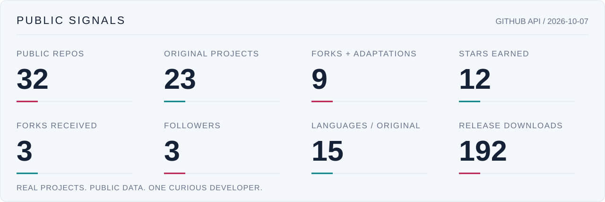
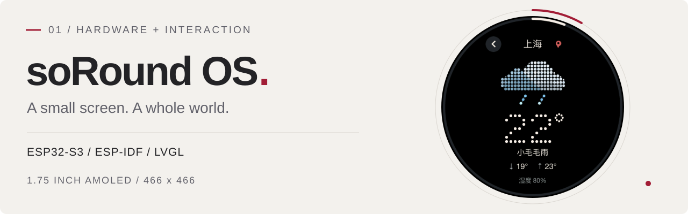
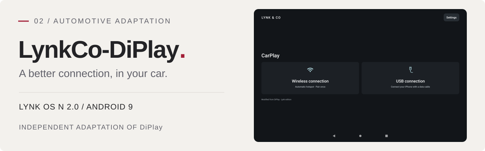

# 米大饭 · soBigRice

**独立开发者 / 自学玩家 / 喵了个bug employee_001**

从 Web 图形到桌面工具，从掌心圆屏到车机适配。喜欢把好奇心做成能运行的东西，把界面、代码和真实设备一起打磨。

[个人主页 ↗](https://sobigrice.com) &nbsp; / &nbsp; [喵总办公室 ↗](https://www.miaozong.cc/) &nbsp; / &nbsp; [技术博客 ↗](https://blog.sobigrice.com) &nbsp; / &nbsp; [所有仓库 ↗](https://github.com/soBigRice?tab=repositories) &nbsp; / &nbsp; [npm ↗](https://www.npmjs.com/package/cesium.path)

## 01 / 开源驾驶舱 · Public Signals

<picture>
  <source media="(prefers-color-scheme: dark)" srcset="./assets/profile-signals-dark.svg" />
  
</picture>

<!-- PROFILE:snapshot:START -->
数据快照：**2026-10-07** · 仅公开资料 · 日期按 UTC+8。图表与表格的统计范围分别在下方注明。
<!-- PROFILE:snapshot:END -->

<!-- PROFILE:account:START -->
| 指标 | 数据 | 范围 |
| --- | --- | --- |
| 公开仓库 | 32 | 原创 23 / Fork 9 |
| 获得的 Stars / Forks | 12 / 3 | 本人名下全部公开仓库，含适配 Fork |
| 关注者 / 正在关注 | 3 / 3 | GitHub 公开账号数据 |
| 公开 Gists | 0 | 公开代码片段 |
| 加入 GitHub | 2020-04-10 | 账号创建日期 |
| 原创仓库语言种类 | 15 | GitHub Linguist 检测结果，排除 Fork |
| 公开 Releases | 51 | 含预发布，排除草稿 |
| Release 附件下载 | 192 | 仅 GitHub 下载次数，不含 OTA / 镜像 / npm |
<!-- PROFILE:account:END -->

### 贡献趋势 / 原创仓库 / 提交时段

<picture>
  <source media="(prefers-color-scheme: dark)" srcset="https://github-profile-summary-cards.vercel.app/api/cards/profile-details?username=soBigRice&amp;theme=radical&amp;animation=draw&amp;duration=2&amp;utcOffset=8&amp;bg_color=111018&amp;title_color=ff537c&amp;text_color=dae1ef&amp;border_color=30263f&amp;icon_color=48ead3&amp;chart_color=ff537c" />
  
</picture>

<picture>
  <source media="(prefers-color-scheme: dark)" srcset="https://github-profile-summary-cards.vercel.app/api/cards/stats?username=soBigRice&amp;theme=radical&amp;animation=draw&amp;duration=2&amp;utcOffset=8&amp;bg_color=111018&amp;title_color=ff537c&amp;text_color=dae1ef&amp;border_color=30263f&amp;icon_color=48ead3&amp;chart_color=ff537c" />
  
</picture>
<picture>
  <source media="(prefers-color-scheme: dark)" srcset="https://github-profile-summary-cards.vercel.app/api/cards/productive-time?username=soBigRice&amp;theme=radical&amp;animation=draw&amp;duration=2&amp;utcOffset=8&amp;bg_color=111018&amp;title_color=ff537c&amp;text_color=dae1ef&amp;border_color=30263f&amp;icon_color=48ead3&amp;chart_color=ff537c" />
  
</picture>

动态卡片由 GitHub Profile Summary Cards 生成，使用公开可见数据与服务缓存。卡片的仓库数 / Stars 排除 Fork；上方 API 快照包含 Fork。Commit、PR、Issue 与贡献次数是不同指标，不能直接相加。

## 02 / 正在构建 · Recent Builds

### [soRound OS](https://github.com/soBigRice/soRound_os) · 掌心里的小世界

<a href="https://sobigrice.github.io/soRound_os/">
  <picture>
    <source media="(prefers-color-scheme: dark)" srcset="./assets/project-soround-dark.svg" />
    
  </picture>
</a>

给 **1.75 英寸圆形 AMOLED** 做一套轻量系统：表盘、天气、音频可视化、小游戏、BLE 遥控与数字孪生，还有双分区 OTA。硬件、固件与 Web 交互一起打磨。

`ESP32-S3` · `C` · `ESP-IDF` · `LVGL` · `Three.js`

**[逛项目官网 ↗](https://sobigrice.github.io/soRound_os/)** &nbsp; / &nbsp; [看源码](https://github.com/soBigRice/soRound_os) &nbsp; / &nbsp; [固件与发布记录](https://github.com/soBigRice/soRound_os/releases)

 

### [LynkCo-DiPlay](https://github.com/soBigRice/LynkCo-DiPlay) · 把体验带进车里

<a href="https://sobigrice.github.io/LynkCo-DiPlay/">
  <picture>
    <source media="(prefers-color-scheme: dark)" srcset="./assets/project-lynkco-dark.svg" />
    
  </picture>
</a>

基于 **[DiPlay](https://github.com/shihabal3amri/DiPlay)** 的领克车机 CarPlay 适配，围绕 Android 9 的连接恢复、界面与诊断做改进。

`Kotlin` · `Android 9` · `Lynk OS N 2.0` · `CarPlay`

**[了解项目 ↗](https://sobigrice.github.io/LynkCo-DiPlay/)** &nbsp; / &nbsp; [看源码](https://github.com/soBigRice/LynkCo-DiPlay) &nbsp; / &nbsp; [兼容与构建说明](https://github.com/soBigRice/LynkCo-DiPlay/blob/main/README.zh-CN.md)

独立适配，保留上游署名；有线已有实车验证，无线仍待验证。当前公开源码，完整 APK 尚未发布。具体支持范围以项目说明为准。

 

## 03 / 技术光谱 · Languages & Stack

<picture>
  <source media="(prefers-color-scheme: dark)" srcset="https://github-profile-summary-cards.vercel.app/api/cards/most-commit-language?username=soBigRice&amp;theme=radical&amp;animation=draw&amp;duration=2&amp;utcOffset=8&amp;bg_color=111018&amp;title_color=ff537c&amp;text_color=dae1ef&amp;border_color=30263f&amp;icon_color=48ead3&amp;chart_color=ff537c" />
  
</picture>

**原创仓库语言分布** · 下表统计原创公开仓库的 GitHub Linguist 字节量，排除全部 Fork；代表仓库内容分布，不代表本人逐行编写的代码量或熟练度排名。

<!-- PROFILE:languages:START -->
| 语言 | 代码字节 | 占比 | 涉及原创仓库 |
| --- | --- | --- | --- |
| C | 13,020,039 | 61.42% | 3 |
| JavaScript | 5,564,071 | 26.25% | 15 |
| HTML | 1,404,367 | 6.62% | 15 |
| TypeScript | 342,509 | 1.62% | 10 |
| Swift | 283,383 | 1.34% | 2 |
| CSS | 156,783 | 0.74% | 13 |
| Rust | 114,038 | 0.54% | 1 |
| C++ | 107,768 | 0.51% | 2 |
| Python | 80,366 | 0.38% | 1 |
| Vue | 66,410 | 0.31% | 2 |
| GLSL | 27,134 | 0.13% | 2 |
| CMake | 18,549 | 0.09% | 1 |
| Shell | 11,281 | 0.05% | 2 |
| Dockerfile | 1,618 | 0.01% | 3 |
| Batchfile | 293 | 0.00% | 1 |
<!-- PROFILE:languages:END -->

| 工作领域 | 技术与工具 | 对应作品 |
| --- | --- | --- |
| Web 与图形 | TypeScript / JavaScript / Vue / React / Three.js / GLSL / WebGL / WebGPU / Cesium | Three Shader Example / cesium.path / Hello WebGPU / AR & XR |
| 桌面工具 | Rust / Tauri / Swift / macOS / Windows | Port Guardian / oh-fans / ohBangs |
| 嵌入式与交互 | C / ESP32-S3 / ESP-IDF / LVGL / AMOLED / E-Ink / BLE | soRound OS / WiFi Calendar |
| 车机适配 | Kotlin / Android 9 / Lynk OS N 2.0 / CarPlay | LynkCo-DiPlay · 基于 DiPlay |
| 服务与交付 | Node.js / Git / GitHub Actions | API Cache / Lsky Server / NodeMessage / 固件发布 |

## 04 / 全部原创作品 · Project Atlas

公开原创仓库按最近推送排序；日期按 UTC+8。`★` Stars · `⑂` Forks · `Open` 开放 Issue/PR（GitHub API 合并计数）。未识别许可或语言时如实显示；手机可横向查看宽表。

<!-- PROFILE:original:START -->
| 项目 | 方向与说明 | 主要语言 | 数据 | 最近推送 | 许可 | 入口 |
| --- | --- | --- | --- | --- | --- | --- |
| [soRound_os](https://github.com/soBigRice/soRound_os) | **嵌入式系统** 基于微雪（Waveshare）1.75 寸圆形电容触摸 AMOLED 开发板做的一个精简化系统 | C / Python / HTML | ★ 0 ⑂ 0 Open 0 | 2026-10-07 | 未识别 | [源码](https://github.com/soBigRice/soRound_os) · [访问](https://sobigrice.github.io/soRound_os/) · [发布](https://github.com/soBigRice/soRound_os/releases) |
| [soBigRice](https://github.com/soBigRice/soBigRice) | **个人主页** 我的个人博客介绍 | 未识别 | ★ 0 ⑂ 0 Open 0 | 2026-10-07 | 未识别 | [源码](https://github.com/soBigRice/soBigRice) |
| [port-guardian](https://github.com/soBigRice/port-guardian) | **桌面工具** 一个Mac和window上的端口进程管理工具 | Rust / TypeScript / CSS | ★ 4 ⑂ 0 Open 0 | 2026-07-03 | 未识别 | [源码](https://github.com/soBigRice/port-guardian) · [发布](https://github.com/soBigRice/port-guardian/releases) |
| [three_shader_example](https://github.com/soBigRice/three_shader_example) | **图形实验** 一个vibecoding的threejs的shader案例库 | TypeScript / GLSL / CSS | ★ 0 ⑂ 0 Open 0 | 2026-05-15 | 未识别 | [源码](https://github.com/soBigRice/three_shader_example) · [访问](https://sobigrice.github.io/three_shader_example/) |
| [ohBangs](https://github.com/soBigRice/ohBangs) | **桌面交互** mac上的灵动岛 | 未识别 | ★ 0 ⑂ 0 Open 0 | 2026-05-04 | MIT | [源码](https://github.com/soBigRice/ohBangs) |
| [oh-fans](https://github.com/soBigRice/oh-fans) | **桌面工具** 我自己做的mac上的一个风扇软件 | Swift / Shell / C | ★ 0 ⑂ 0 Open 0 | 2026-04-27 | 未识别 | [源码](https://github.com/soBigRice/oh-fans) · [访问](https://github.com/soBigRice/oh-fans/releases/latest) · [发布](https://github.com/soBigRice/oh-fans/releases) |
| [-API-](https://github.com/soBigRice/-API-) | **服务端** 由于某些接口有免费次数也不是实时更新的，所以我开发了这个接口合集，将一些数据临时存储到本地 | TypeScript / JavaScript / Dockerfile | ★ 0 ⑂ 0 Open 0 | 2026-03-26 | 未识别 | [源码](https://github.com/soBigRice/-API-) |
| [lsky_v2.1_node_server](https://github.com/soBigRice/lsky_v2.1_node_server) | **服务端** 一个基于兰空图床v2.1开源版本的nodejs服务 | JavaScript / Dockerfile | ★ 0 ⑂ 0 Open 0 | 2026-03-23 | MIT | [源码](https://github.com/soBigRice/lsky_v2.1_node_server) |
| [snapshot](https://github.com/soBigRice/snapshot) | **游戏实验** 一个简单的射击小游戏 | TypeScript / CSS / JavaScript | ★ 0 ⑂ 0 Open 0 | 2026-03-06 | MIT | [源码](https://github.com/soBigRice/snapshot) · [访问](https://sobigrice.github.io/snapshot/) |
| [WebGL_heart_beat](https://github.com/soBigRice/WebGL_heart_beat) | **图形实验** webGL心跳模版 | Vue / TypeScript / GLSL | ★ 0 ⑂ 0 Open 0 | 2026-03-06 | 未识别 | [源码](https://github.com/soBigRice/WebGL_heart_beat) · [访问](https://sobigrice.github.io/WebGL_heart_beat/) · [发布](https://github.com/soBigRice/WebGL_heart_beat/releases) |
| [wifiCalendar](https://github.com/soBigRice/wifiCalendar) | **嵌入式设备** 一个用ESP32+墨水屏开发的智能wifi日历 | C / C++ | ★ 0 ⑂ 0 Open 0 | 2026-03-02 | 未识别 | [源码](https://github.com/soBigRice/wifiCalendar) |
| [graphical.top](https://github.com/soBigRice/graphical.top) | **图形内容** graphical.top的内容补充 | Vue / CSS / HTML | ★ 0 ⑂ 0 Open 0 | 2026-02-14 | 未识别 | [源码](https://github.com/soBigRice/graphical.top) |
| [github_action_server](https://github.com/soBigRice/github_action_server) | **开发工具** 一个github的action服务 | JavaScript | ★ 0 ⑂ 0 Open 0 | 2026-02-14 | 未识别 | [源码](https://github.com/soBigRice/github_action_server) |
| [Hello-WebGPU](https://github.com/soBigRice/Hello-WebGPU) | **图形实验** 一个webGPU的欢迎页面，用了WGSL的shader | JavaScript / HTML / CSS | ★ 0 ⑂ 0 Open 0 | 2026-01-29 | 未识别 | [源码](https://github.com/soBigRice/Hello-WebGPU) |
| [NodeMessage](https://github.com/soBigRice/NodeMessage) | **服务端** 一个用nodejs写的消息通知服务，通知到邮件 | JavaScript / Shell / Dockerfile | ★ 0 ⑂ 0 Open 0 | 2025-07-09 | ISC | [源码](https://github.com/soBigRice/NodeMessage) |
| [Cesium.path](https://github.com/soBigRice/Cesium.path) | **图形组件** — | JavaScript / CSS / HTML | ★ 0 ⑂ 1 Open 0 | 2025-05-12 | MIT | [源码](https://github.com/soBigRice/Cesium.path) |
| [fpsActor](https://github.com/soBigRice/fpsActor) | **游戏实验** — | TypeScript / CSS / HTML | ★ 0 ⑂ 0 Open 0 | 2025-05-10 | 未识别 | [源码](https://github.com/soBigRice/fpsActor) · [访问](https://sobigrice.github.io/fpsActor/) |
| [old_github_io](https://github.com/soBigRice/old_github_io) | **工具集合** 一个妄图集大成者的工具库。加油吧，努力搬砖 | HTML / JavaScript / CSS | ★ 0 ⑂ 1 Open 0 | 2024-11-14 | MIT | [源码](https://github.com/soBigRice/old_github_io) |
| [ar_view](https://github.com/soBigRice/ar_view) | **AR 实验** a sample demo for show WebAR by Three.js | JavaScript / HTML / CSS | ★ 0 ⑂ 0 Open 0 | 2024-11-13 | 未识别 | [源码](https://github.com/soBigRice/ar_view) · [访问](https://ar-view.vercel.app) |
| [npm-library-universal-template](https://github.com/soBigRice/npm-library-universal-template) | **开发模板** — | TypeScript / HTML / JavaScript | ★ 0 ⑂ 0 Open 0 | 2024-06-05 | MIT | [源码](https://github.com/soBigRice/npm-library-universal-template) |
| [guigui267.github.io](https://github.com/soBigRice/guigui267.github.io) | **早期主页** 本人的第一个github网站测试用 | HTML / CSS / JavaScript | ★ 0 ⑂ 0 Open 0 | 2023-02-22 | 未识别 | [源码](https://github.com/soBigRice/guigui267.github.io) |
| [3Ddemo](https://github.com/soBigRice/3Ddemo) | **图形组件** 一个简单的3D网页，基于Three封装，把场景等元素直接封装了，直接调用就好了 | JavaScript / HTML | ★ 0 ⑂ 0 Open 0 | 2021-11-18 | 未识别 | [源码](https://github.com/soBigRice/3Ddemo) |
| [Graduation-project-WebXR](https://github.com/soBigRice/Graduation-project-WebXR) | **XR 实验** — | JavaScript / CSS / HTML | ★ 0 ⑂ 0 Open 0 | 2021-05-14 | 未识别 | [源码](https://github.com/soBigRice/Graduation-project-WebXR) |
<!-- PROFILE:original:END -->

## 05 / Fork 与适配 · Built on Open Source

包括正在开发的领克适配与其他公开 Fork。Fork 关系由 GitHub 标识；原作者、上游许可与适用范围以各仓库为准。

<!-- PROFILE:forks:START -->
| 项目 | 方向与说明 | 主要语言 | 数据 | 最近推送 | 许可 | 入口 |
| --- | --- | --- | --- | --- | --- | --- |
| [LynkCo-DiPlay](https://github.com/soBigRice/LynkCo-DiPlay) | **领克适配** 领克OSN版本的carplay兼容 | Kotlin / HTML / C | ★ 8 ⑂ 1 Open 0 | 2026-10-07 | GPL-3.0 | [源码](https://github.com/soBigRice/LynkCo-DiPlay) · [访问](https://soBigRice.github.io/LynkCo-DiPlay/) |
| [three.path](https://github.com/soBigRice/three.path) | **Fork** three.path is a three.js extension which provides a 3D path geometry builder. | JavaScript | ★ 0 ⑂ 0 Open 0 | 2024-12-04 | MIT | [源码](https://github.com/soBigRice/three.path) |
| [AR.js](https://github.com/soBigRice/AR.js) | **Fork** Image tracking, Location Based AR, Marker tracking. All on the Web. | JavaScript / HTML / Brainfuck | ★ 0 ⑂ 0 Open 0 | 2024-11-13 | MIT | [源码](https://github.com/soBigRice/AR.js) |
| [load-bmfont](https://github.com/soBigRice/load-bmfont) | **Fork** loads a BMFont file in Node and the browser | JavaScript | ★ 0 ⑂ 0 Open 0 | 2024-10-31 | MIT | [源码](https://github.com/soBigRice/load-bmfont) |
| [aliyundrive-checkin](https://github.com/soBigRice/aliyundrive-checkin) | **Fork** 阿里云盘自动签到程序 | Python | ★ 0 ⑂ 0 Open 0 | 2024-04-07 | 未识别 | [源码](https://github.com/soBigRice/aliyundrive-checkin) |
| [extend_three.js](https://github.com/soBigRice/extend_three.js) | **Fork** JavaScript 3D Library. | JavaScript / HTML / Roff | ★ 0 ⑂ 0 Open 0 | 2023-08-10 | MIT | [源码](https://github.com/soBigRice/extend_three.js) · [访问](https://threejs.org/) |
| [lodash-utils](https://github.com/soBigRice/lodash-utils) | **Fork** 基于 evil.js 优化，引入之后, 可以当作 lodash 使用，然后在特定条件下产生一些错误。 | JavaScript | ★ 0 ⑂ 0 Open 0 | 2022-08-25 | MIT | [源码](https://github.com/soBigRice/lodash-utils) |
| [three-bmfont-text](https://github.com/soBigRice/three-bmfont-text) | **Fork** renders BMFont files in ThreeJS with word-wrapping | JavaScript / GLSL / HTML | ★ 0 ⑂ 0 Open 0 | 2022-07-25 | MIT | [源码](https://github.com/soBigRice/three-bmfont-text) · [访问](http://jam3.github.io/three-bmfont-text/test/) |
| [metaverse](https://github.com/soBigRice/metaverse) | **Fork** metaverse | TypeScript / JavaScript / HTML | ★ 0 ⑂ 0 Open 0 | 2021-12-17 | 未识别 | [源码](https://github.com/soBigRice/metaverse) |
<!-- PROFILE:forks:END -->

## 06 / 版本与下载 · Shipping Log

只统计本人名下公开 Release 和附件下载；包含预发布版本，排除草稿。下载次数不等于设备数量，GitHub 之外的 OTA、镜像和 npm 不在此表内。

<!-- PROFILE:releases:START -->
| 项目 | 最近正式版 | 最近发布 | Release 数 | 附件总下载 | 最近发布日期 |
| --- | --- | --- | --- | --- | --- |
| [soRound_os](https://github.com/soBigRice/soRound_os) | [v1.6.1](https://github.com/soBigRice/soRound_os/releases/tag/v1.6.1) | [v1.7-beta.29](https://github.com/soBigRice/soRound_os/releases/tag/v1.7-beta.29) · 预发布 | 34 | 28 | 2026-10-07 |
| [port-guardian](https://github.com/soBigRice/port-guardian) | [v0.2.10](https://github.com/soBigRice/port-guardian/releases/tag/v0.2.10) | [v0.2.10](https://github.com/soBigRice/port-guardian/releases/tag/v0.2.10) | 14 | 149 | 2026-07-03 |
| [oh-fans](https://github.com/soBigRice/oh-fans) | [v1.0.1](https://github.com/soBigRice/oh-fans/releases/tag/v1.0.1) | [v1.0.1](https://github.com/soBigRice/oh-fans/releases/tag/v1.0.1) | 2 | 15 | 2026-04-24 |
| [WebGL_heart_beat](https://github.com/soBigRice/WebGL_heart_beat) | [v1.0.0](https://github.com/soBigRice/WebGL_heart_beat/releases/tag/v1.0.0) | [v1.0.0](https://github.com/soBigRice/WebGL_heart_beat/releases/tag/v1.0.0) | 1 | 0 | 2026-03-06 |
<!-- PROFILE:releases:END -->

## 07 / 贡献轨迹 · Keep Building

<picture>
  <source media="(prefers-color-scheme: light)" srcset="https://raw.githubusercontent.com/soBigRice/soBigRice/output/github-snake.svg" />
  
</picture>

2020 年开始自学开发。持续做工具、试图形、折腾小设备，也持续把没做好的地方重新做一遍。

---

**喵总负责验收。米大饭负责下一次提交。**

[soBigRice](https://github.com/soBigRice) &nbsp; · &nbsp; [miaozong.cc](https://www.miaozong.cc/) &nbsp; · &nbsp; [sobigrice.com](https://sobigrice.com)

