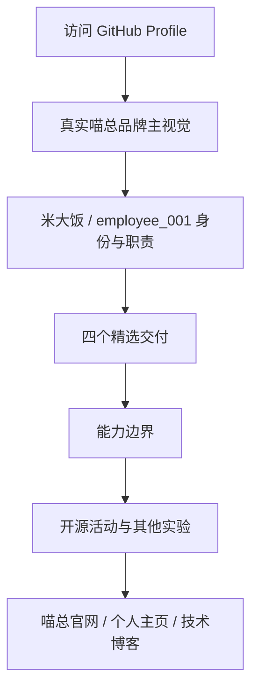
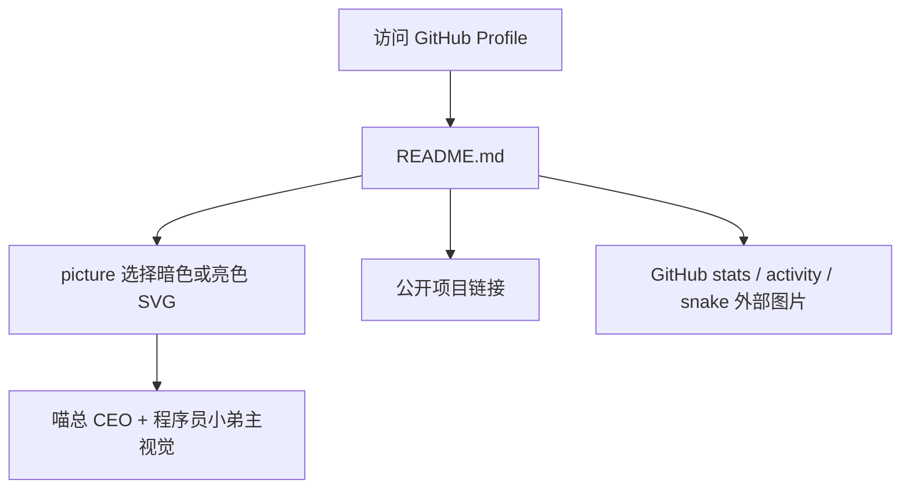

# GitHub Profile README 喵总联名改版

## 状态

- 第一轮已实现、已验证
- 第二轮视觉重构已实现、已验证

## 第二轮设计审计

用户查看 GitHub 实际页面后确认：上一轮虽然加入了“喵总 CEO / employee_001”人设，但整体风格仍然不搭。

### 当前视觉问题

- 顶部假终端、幼态矢量猫头像、badge、项目卡片、技能图标和统计图分别使用不同的视觉语言，没有形成统一品牌。
- 终端语法贯穿几乎所有标题，程序员身份表达过量，喵总仍然更像一个文案梗，而不是品牌主角。
- 首屏同时出现主视觉、长句定位和六个 badge，缺少单一视觉焦点。
- 六个项目卡片、长尾项目表格、技能图标、技术栈文本和多张统计图重复表达“会很多技术”，信息密度高但专业判断不突出。
- 喵总官网已经有成熟的黑色、炭灰、暗红和真实猫角色资产，GitHub README 没有继承这套品牌材质。

### 品牌与内容真值

- 喵总官网定位：喵了个bug虚拟科技公司 CEO，负责提出需求、验收和署名。
- 米大饭定位：`employee_001`，负责把想法做成能运行、能上线、能交付的产品。
- 喵总官网现有主视觉 `hero-cat-lab.webp` 是本轮品牌资产真值，优先复用，不重新生成风格不一致的猫形象。
- GitHub README 的首要受众是开发者和潜在合作方，项目结果应比技术标签更靠前。

### 第二轮目标

- 视觉方向从“CEO inspection console”改为“喵总签批的工程档案”。
- 顶部只保留真实品牌主视觉、身份和一句职责关系，取消 badge 墙。
- 主内容压缩为身份、精选交付、能力边界和开源记录四层。
- 精选交付只展示四个有代表性的公开项目，其余项目放入折叠区。
- 取消技能图标墙、Top Languages 和重复统计卡，只保留一张活动图与折叠贡献图。
- 使用 GitHub 原生排版和少量 HTML，不再新增一套伪产品 UI。

### 第二轮验收标准

- 第一屏只出现一个主视觉焦点，能直接识别喵总和 employee_001 的关系。
- README 不再使用 shields badge、skillicons 或假终端主视觉。
- 默认展开内容不超过四个主项目，项目描述说明解决的问题，不堆技术名词。
- 暗色品牌图片在 GitHub 明暗主题下都可阅读。
- 所有项目、站点和图片链接有效。
- 文档、README、资源文件和远端提交状态一致。

### 第二轮实施流程

### 第二轮风险和回滚

- 风险：GitHub Profile 外层头像、简介和置顶仓库不由 README 文件控制，仍可能造成页面级不一致。
- 应对：README 先统一自身视觉；外层简介和置顶仓库作为单独的 GitHub 资料调整，不在代码提交中静默修改。
- 回滚：恢复提交 `6fa5beb` 的 README 和 hero SVG。

### 第二轮实际实现结果

- 新增 `assets/miaozong-profile-hero.webp`，从喵总官网现有 `hero-cat-lab.webp` 裁切为 `1672 x 700` 的 GitHub 横幅，文件大小约 `109 KB`。
- 删除 `assets/hero-terminal.svg` 和 `assets/hero-terminal-light.svg`，彻底退役假终端与幼态矢量猫视觉。
- README 从约 200 行压缩到约 90 行，删除 shields badge、skillicons、GitHub Stats、Top Languages 和重复技术清单。
- 默认展开区只保留四个精选交付：Port Guardian、Three Shader Example、WiFi Calendar、cesium.path。
- 其他公开实验和贡献图小蛇保留在折叠区，开源记录只保留一张与品牌暗红色一致的活动图。
- 顶部、正文和页尾统一使用“喵总负责决策与验收，employee_001 负责交付”的单一叙事。

### 第二轮验证结果

- `git diff --check` 通过。
- GitHub Markdown API 成功渲染主视觉、标题、四行项目表、两个 `details` 折叠区和明暗主题活动图。
- 主视觉文件可识别为 `1672 x 700` WebP，并已人工检查裁切构图。
- 喵总官网、个人主页、技术博客、主项目、在线 Demo、活动图和小蛇资源均返回成功状态。
- npm 页面会拒绝普通自动请求，但 `npm view cesium.path` 已确认公开包 `cesium.path@0.0.8` 存在。
- 折叠区九个公开仓库均已通过 GitHub API 验证。

### 第二轮与计划偏差

- 未重新生成喵总图片。设计审计确认官网现有主视觉已经是成熟品牌资产，复用它比生成新的猫形象更能保证两个站点一致。
- 未修改 GitHub 账户简介和置顶仓库。它们不属于本仓库代码，保留为后续单独确认的资料调整。

# 第一轮记录（历史）

## 背景

当前仓库是 `soBigRice` GitHub Profile README 仓库。用户希望结合 `https://www.miaozong.cc/` 的喵总人设，以及自己“程序员小弟”的人设，重新设计 GitHub 主页样式，解决现有个人主页“有点土”的问题。

## 当前行为

- README 主要使用终端梗、徽章、项目表格和 GitHub stats 图片。
- 视觉上偏常见 profile README 模板：徽章密集、长表格堆叠、喵总人设没有进入信息架构。
- `assets/hero-terminal.svg` 和 `assets/hero-terminal-light.svg` 是顶部主视觉，当前表达的是普通个人终端。

## 目标行为

- 顶部第一屏建立“喵总 CEO 负责巡视验收，米大饭负责执行交付”的记忆点。
- README 结构从“工具列表堆叠”改成“角色关系、公开项目、技术栈、统计入口”的清晰叙事。
- 只引用公开站点和公开仓库，不把私有仓库写进公开 profile。
- 不改 GitHub Actions 小蛇 workflow，不引入构建依赖。

## 范围

- 更新 `README.md`。
- 更新暗色/亮色 hero SVG。
- 保留贡献小蛇、GitHub stats、公开项目入口。

## 非目标

- 不重构 GitHub Actions。
- 不发布或推送远端。
- 不创建完整网站或额外前端应用。
- 不暴露私有仓库名称、链接或内部进度。

## 需求和验收标准

- README 顶部能直接看出喵总和程序员小弟的角色关系。
- 公开项目入口清晰，优先展示 `port-guardian`、`three_shader_example`、`oh-fans`、`ohBangs`、`wifiCalendar`、`cesium.path`。
- Markdown 与 SVG 引用路径有效。
- `git diff --check` 无空白错误。
- SVG 文件 XML 结构可解析。

## 现有实现分析

- 仓库没有 `package.json`，说明这是静态 GitHub profile README，不适合引入前端框架。
- GitHub README 对自定义 CSS 支持有限，适合使用 HTML table、`picture`、SVG 图片和外部 stats 图片组合完成视觉。
- 现有 SVG 已有暗/亮模式切换，可继续沿用这一机制。

## 技术方案

- 用 GitHub Primer 色系做基础，避免随机霓虹和过量 badge。
- 顶部 SVG 改成“CEO inspection console”，在可渲染图片里承载更多视觉识别。
- README 可见内容分为四块：角色关系、公开项目、技术栈/工作方式、折叠统计。
- 把长尾项目放入 `details`，降低首屏噪音。

## 涉及文件和模块

- `README.md`
- `assets/hero-terminal.svg`
- `assets/hero-terminal-light.svg`

## 调用链或数据流

## 兼容性、性能和安全影响

- 兼容 GitHub README 的静态 Markdown/HTML 渲染限制。
- SVG 为本仓库静态资源，无运行时脚本。
- 外部图片仍来自现有 stats、shields、skillicons 与 snake 资源。
- README 中不新增私有仓库链接。

## 实施步骤

1. 核对喵总网站公开描述和 GitHub 当前公开资料。
2. 重写 README 信息架构与文案。
3. 改造暗/亮 hero SVG。
4. 执行 Markdown/SVG/空白检查。
5. 回写实际实现结果与偏差。

## 测试和验证计划

- `git diff --check`
- `xmllint --noout assets/hero-terminal.svg assets/hero-terminal-light.svg`
- 检查 README 中的本地资源引用是否存在。

## 风险和回滚方案

- 风险：GitHub README 对复杂 HTML/CSS 支持有限。
- 应对：只使用 GitHub README 常见可用结构，主要视觉放进 SVG 图片。
- 回滚：恢复上一版 `README.md` 和两个 SVG。

## 实际实现结果

- README 顶部改为“喵总巡视 + 员工 001 执行”的品牌叙事。
- Hero SVG 改为 CEO inspection console，暗/亮主题同步。
- 项目展示改为精选公开项目 + 折叠实验清单。
- GitHub stats 和贡献小蛇保留但降噪为折叠区。
- 已执行 `git diff --check`，无空白错误。
- 已执行 `xmllint --noout assets/hero-terminal.svg assets/hero-terminal-light.svg`，两个 SVG 均可解析。
- 已用 `rsvg-convert` 渲染暗/亮 SVG 预览，确认静态状态下文字和喵总卡片可见。

## 与原计划的偏差

- 初版 SVG 的延迟显隐会导致静态渲染器只显示首行；已调整为静态可见、动画增强的实现。

## 历史问题记录

- 旧问题：README 容易退回“徽章堆叠 + stats 堆叠”的通用 profile 模板。
- 防复发：后续新增内容时优先判断是否服务“喵总 CEO / 员工 001 / 自学型开发者”这条主叙事；不服务主叙事的内容放入折叠区。
- 第二轮确认问题：仅更换文案和终端皮肤不能解决风格统一，真实品牌资产、信息层级和删减力度必须同时调整。
- 第二轮防复发：主视觉只使用喵总官网同源资产；README 默认展开区最多保留一个视觉系统、四个主项目和一张统计图。
