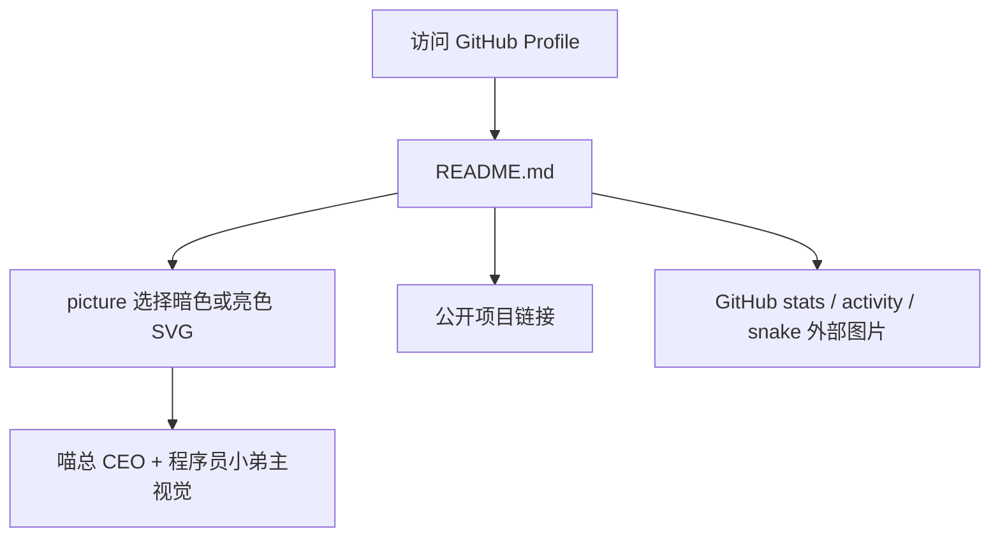

# GitHub Profile README 喵总联名改版

## 状态

- 已实现
- 已验证

## 背景

当前仓库是 `soBigRice` GitHub Profile README 仓库。用户希望结合 `https://www.miaozong.cc/` 的喵总人设，以及自己“程序员小弟”的人设，重新设计 GitHub 主页样式，解决现有个人主页“有点土”的问题。

## 当前行为

- README 主要使用终端梗、徽章、项目表格和 GitHub stats 图片。
- 视觉上偏常见 profile README 模板：徽章密集、长表格堆叠、喵总人设没有进入信息架构。
- `assets/hero-terminal.svg` 和 `assets/hero-terminal-light.svg` 是顶部主视觉，当前表达的是普通个人终端。

## 目标行为

- 顶部第一屏建立“喵总 CEO 负责巡视验收，米大饭负责执行交付”的记忆点。
- README 结构从“工具列表堆叠”改成“角色关系、公开项目、技术栈、统计入口”的清晰叙事。
- 只引用公开站点和公开仓库，不把私有仓库写进公开 profile。
- 不改 GitHub Actions 小蛇 workflow，不引入构建依赖。

## 范围

- 更新 `README.md`。
- 更新暗色/亮色 hero SVG。
- 保留贡献小蛇、GitHub stats、公开项目入口。

## 非目标

- 不重构 GitHub Actions。
- 不发布或推送远端。
- 不创建完整网站或额外前端应用。
- 不暴露私有仓库名称、链接或内部进度。

## 需求和验收标准

- README 顶部能直接看出喵总和程序员小弟的角色关系。
- 公开项目入口清晰，优先展示 `port-guardian`、`three_shader_example`、`oh-fans`、`ohBangs`、`wifiCalendar`、`cesium.path`。
- Markdown 与 SVG 引用路径有效。
- `git diff --check` 无空白错误。
- SVG 文件 XML 结构可解析。

## 现有实现分析

- 仓库没有 `package.json`，说明这是静态 GitHub profile README，不适合引入前端框架。
- GitHub README 对自定义 CSS 支持有限，适合使用 HTML table、`picture`、SVG 图片和外部 stats 图片组合完成视觉。
- 现有 SVG 已有暗/亮模式切换，可继续沿用这一机制。

## 技术方案

- 用 GitHub Primer 色系做基础，避免随机霓虹和过量 badge。
- 顶部 SVG 改成“CEO inspection console”，在可渲染图片里承载更多视觉识别。
- README 可见内容分为四块：角色关系、公开项目、技术栈/工作方式、折叠统计。
- 把长尾项目放入 `details`，降低首屏噪音。

## 涉及文件和模块

- `README.md`
- `assets/hero-terminal.svg`
- `assets/hero-terminal-light.svg`

## 调用链或数据流

## 兼容性、性能和安全影响

- 兼容 GitHub README 的静态 Markdown/HTML 渲染限制。
- SVG 为本仓库静态资源，无运行时脚本。
- 外部图片仍来自现有 stats、shields、skillicons 与 snake 资源。
- README 中不新增私有仓库链接。

## 实施步骤

1. 核对喵总网站公开描述和 GitHub 当前公开资料。
2. 重写 README 信息架构与文案。
3. 改造暗/亮 hero SVG。
4. 执行 Markdown/SVG/空白检查。
5. 回写实际实现结果与偏差。

## 测试和验证计划

- `git diff --check`
- `xmllint --noout assets/hero-terminal.svg assets/hero-terminal-light.svg`
- 检查 README 中的本地资源引用是否存在。

## 风险和回滚方案

- 风险：GitHub README 对复杂 HTML/CSS 支持有限。
- 应对：只使用 GitHub README 常见可用结构，主要视觉放进 SVG 图片。
- 回滚：恢复上一版 `README.md` 和两个 SVG。

## 实际实现结果

- README 顶部改为“喵总巡视 + 员工 001 执行”的品牌叙事。
- Hero SVG 改为 CEO inspection console，暗/亮主题同步。
- 项目展示改为精选公开项目 + 折叠实验清单。
- GitHub stats 和贡献小蛇保留但降噪为折叠区。
- 已执行 `git diff --check`，无空白错误。
- 已执行 `xmllint --noout assets/hero-terminal.svg assets/hero-terminal-light.svg`，两个 SVG 均可解析。
- 已用 `rsvg-convert` 渲染暗/亮 SVG 预览，确认静态状态下文字和喵总卡片可见。

## 与原计划的偏差

- 初版 SVG 的延迟显隐会导致静态渲染器只显示首行；已调整为静态可见、动画增强的实现。

## 历史问题记录

- 旧问题：README 容易退回“徽章堆叠 + stats 堆叠”的通用 profile 模板。
- 防复发：后续新增内容时优先判断是否服务“喵总 CEO / 员工 001 / 自学型开发者”这条主叙事；不服务主叙事的内容放入折叠区。
