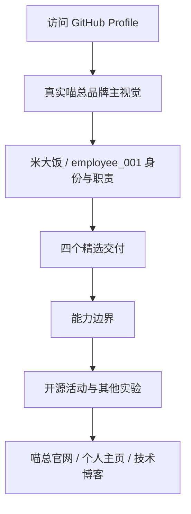
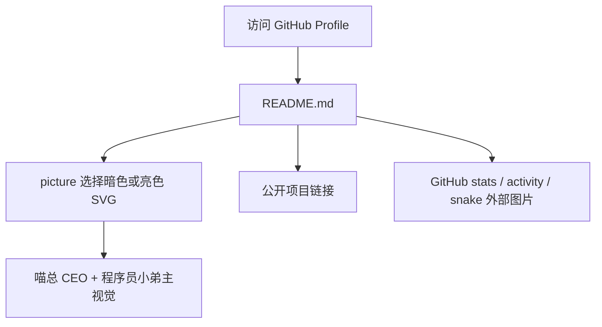

# GitHub Profile 设计与维护记录

## 当前版本 · 2026-10-08 拾贴与统计卡排版修正

状态：按用户在实际 GitHub 页面的反馈继续改版；发布用于审阅，整体视觉仍待用户验收。第一版与 7 月记录仅为历史，旧的“四项目上限、统计折叠、取消语言卡”已被本次明确需求替代。

### 当前需求与边界

用户明确反馈：“不够酷炫，以及统计的内容不多啊，能显示的信息，以及数据表格都展示出来。”本版采用黑红霓虹喵总横幅、动态贡献图与主题自适应数据面板，账号、语言、全部公开仓库、版本和下载表默认展开。

- 展示 32 个公开仓库：23 个非 Fork 仓库、9 个 Fork；保留 soRound OS、领克适配的真实项目展板与上游署名。
- 只处理 Profile 仓库；账号头像、简介、置顶仓库不在本次范围。使用 GitHub 原生 Markdown / picture / SVG，无前端依赖或新增定时工作流。
- 私有项目、草稿 Release、Release 正文、邮件和凭证不进入快照。语言分布排除 Fork，但原仓库内仍可能有第三方代码，不能视为本人逐行贡献量。

### 展示与维护链路

`README.md` → 霓虹主视觉 → 八项公开指标 → 账号表 / 贡献趋势 / 贡献统计 / UTC+8 提交时段 → 拾贴 · Piklue / soRound OS / LynkCo-DiPlay 三个重点作品展板 → 提交语言图 / 完整语言表 / 技术栈 → 23 个非 Fork 仓库表 → 9 个 Fork 表 → Release 与下载表 → 原有贡献小蛇。

`scripts/refresh_profile.py:collect()` → GitHub 公开账号与 owner 仓库 API → 每仓库 languages / releases 分页 → 排除草稿并按 published_at 排序 → `summarize()` → `assets/profile-data.json` → `render()` → `PROFILE:*` 标记内的六块 README 表格与两张 profile-signals SVG。

刷新方式（Python 标准库 + 已有 GitHub CLI，无安装项）：

```sh
PYTHONDONTWRITEBYTECODE=1 python3 scripts/refresh_profile.py
PYTHONDONTWRITEBYTECODE=1 python3 scripts/refresh_profile.py --from-snapshot assets/profile-data.json
PYTHONDONTWRITEBYTECODE=1 python3 -m unittest discover -s tests -v
```

脚本只更新本地文件，不提交、不推送。所有 API 采集成功、公开性与 README 标记检查通过后才开始写文件；失败报错退出，不用空数据覆盖主页。快照需手动刷新；第三方贡献卡通过服务缓存动态更新。日期为 UTC+8，API open_issues_count 同时包含开放 Issue 与 PR，README 按此标注。

### 统计真源与取舍（2026-10-07）

- 本次 [GitHub REST 公开仓库](https://docs.github.com/en/rest/repos/repos#list-repositories-for-a-user)、[语言字节](https://docs.github.com/en/rest/repos/repos#list-repository-languages) 与 [Release](https://docs.github.com/en/rest/releases/releases#list-releases) 数据：32 仓库、12 Stars、3 次被 Fork、15 种非 Fork 仓库语言、51 个公开 Release、192 次 GitHub 附件下载。下载不含 OTA、镜像、npm，不能当作设备量。
- 贡献卡使用 MIT 许可的 [GitHub Profile Summary Cards](https://github.com/vn7n24fzkq/github-profile-summary-cards)：profile-details / stats / most-commit-language / productive-time。官方支持自定义颜色和 SVG CSS draw 动画。本次四类卡片的深浅主题共八个 URL 均返回 200 与有效 SVG；UTC 偏移设为 8，动画 2 秒。
- 动态卡的仓库与 Stars 排除 Fork（因此卡片 Stars 为 4，快照含领克适配等 Fork 为 12）；贡献次数、Commit、PR、Issue 各有范围，不能直接相加。保留原始图表标签，不编造跨指标的总数。
- 原 activity-graph 端点返回 402、常见 streak 端点返回 403，因此替换；经典 github-readme-stats 原仓库目前标记未维护，因此没有继续增加依赖。动态卡有第三方可用性与缓存成本；基础表格和八项面板保留可维护的公开数据快照。
- 小蛇继续引用现有 output 分支，本次没有调整其生成流程；核对的分支更新日期为 2026-10-07。

### 主视觉与源图

新增 `assets/profile-masthead-v2.webp`，2117×743，约 289 KiB。内置 imagegen 参考现有喵总品牌原图生成，仅转换 WebP 编码，不裁切或替换原件；两版横幅及 `assets/miaozong-profile-hero.webp` 均保留。项目截图沿用第一版真实公开素材。

最终提示词：

> Use case: identity-preserve. Asset type: final wide GitHub developer profile masthead, target landscape 2240 x 700, 3.2:1. The supplied photograph is the existing personal brand's cat CEO. Keep the same photorealistic silver cat identity, black baseball cap and black sunglasses, confidently occupying the right 45%. Upgrade the static quiet studio scene into a cool premium cyber engineering lab: rich black and deep violet background, thin vivid crimson laser arcs orbiting behind the cat, restrained electric cyan edge reflections, translucent spectral ribbons, pin-point stars and luminous geometric engineering lines. Make it striking and sophisticated, not cartoonish, not a generic gaming template. Sharp realistic fur, tactile dark fabric, cinematic contrast, crisp clean 3D depth. Large perfectly legible single-line white typographic name on the left exactly 'soBigRice.' with a small vivid red final period, mixed case exactly s o B i g R i c e. Above in clear tracked monospace capitals exactly 'INDEPENDENT DEVELOPER'. Below large name exactly 'CODE. CREATE. REPEAT.' in medium sans-serif. At bottom-left exactly 'WEB / DESKTOP / HARDWARE'. Design each line with generous spacing and inset margins. Text occupies left 52% without crossing cat face. Name large enough to read on mobile; body type also sharp. Preserve the cat's personality. No diagrams of metrics, no fabricated numbers, no small UI cards, no terminal, no extra slogans, no watermarks or browser frame. New visual should feel noticeably more energetic and futuristic while retaining the current black/red brand and cat identity.

### 验证与当前状态

- 五项单元检查通过：Fork 统计范围、拒绝非公开数据、排除草稿且按发布日期排序、表格文案转义、标记缺失时不覆盖现有文件。
- GitHub Markdown API 最终渲染成功：9 组 picture、10 张图片、6 张表格、64 行数据，无 details。本地 SVG XML、无脚本检查及素材引用检查通过。
- 浏览器实际检查深浅桌面 1280×900 与手机 390×844：9 张图片加载成功，页面无横向溢出；手机项目与 Release 宽表在表内横向滚动。动态图进入视口后完成 draw 动画，正文与图表可读。
- 完整项目表使用 7 列，把方向与说明、Stars / Forks / 开放 Issue/PR 合并到同格，保留全部数据并减少窄列造成的竖排。
- 预览内容来自最终 GitHub Markdown API，动态图片取自本轮已验证的服务响应；外层模拟 GitHub，不能视作实际 GitHub 外层账号布局验收。截图和自包含预览留在本任务可视化目录，未加入仓库；测试页、尺寸覆盖和本地服务器在检查后关闭。
- 发布授权沿用本任务“提交更新一下我看看”的要求，视觉审阅仍以用户反馈为准。由于 github.com 的 Git HTTPS 连接在本机超时，使用已认证 gh 调用官方 Git database API，逐一核对 blob / tree / commit 与本地对象 SHA，再以 force=false 快进主分支；没有关闭 TLS 或重写历史。

### 本次纠正与复用约束

之前默认以压缩信息与折叠统计表现“高级”，没有满足用户对酷炫、丰富公开数据的当前要求。本版按明确反馈展开全部表格，并通过统一配色、标题层次和独立统计口径保持直观。后续不要把早期克制方案当作永久偏好，也不要用减少指标代替信息组织；新增统计先查原始数据和服务状态，注明 Fork、字节、贡献、下载的不同范围。

### 2026-10-08 · 拾贴与官网遗漏修正

用户指出“你没有把我的拾贴，以及官网放进去”。之前将 GitHub 公开仓库列表当作作品清单，漏掉了已有公开官网的产品。现在在顶部联系入口、重点作品区第一位与桌面技术栈中补充拾贴 · Piklue，并提供 [官网](https://piklue.miaozong.cc/)、功能和支持页入口。

- `assets/project-piklue-{dark,light}.svg` 延续现有 1280×400 展板，右侧使用官网 `favicon.svg` 同源图标；这是品牌展板，不是 App 截图。原始图标路径可在拾贴项目 `website/public/favicon.svg` 核对。
- 文案来源为官网的剪贴板历史定位，核对本地 `website/src/components/Hero.tsx` / `Features.tsx` 与 `App.tsx` 的公开网站文案及路由。仅描述剪贴板记录、搜索、截图标注、贴图置顶、本地存储，不声明购买、下载或商店上架状态。
- GitHub 仓库表与计数继续表示真实公开仓库，保留 2026-10-07 统计快照；不为展示产品编造 GitHub 仓库或把私有代码加入公开仓库表。产品展板位于 `PROFILE:*` 生成标记之外，数据刷新应保留它。
- 2026-10-08 检查：官网首页、支持页、favicon 均返回 200；公开 JS 包确认介绍中的功能，favicon 与本地品牌源逐字节一致。最终 GitHub Markdown API 保留 9 组 picture / 10 张图片 / 6 张表格；使用已有快照运行刷新脚本后，拾贴作品区保留，仓库计数仍为 32。
- 新增作品区已实际查看深浅色桌面 1280×900 与手机 390×844 预览，图片加载且无横向溢出；两张 SVG 的离线栅格结果也已核对。测试浏览器页、尺寸覆盖与本地服务器已关闭。截图仅是新增区的 Markdown 预览，完整 GitHub 外层页面仍以用户实际审阅为准。
- 防复发：作品清单应同时核对用户已确认产品和公开官网；仓库 API 负责开源统计，不负责决定哪些产品值得展示。公开营销内容与私有实现边界分别核对。

### 2026-10-08 · 统计卡换行与右侧留白修正

用户提供实际 GitHub 截图：Stats 与 UTC+8 提交时段各占一行左侧，右侧大面积空白。此前两张图片各设为 430px，总宽 860px 加空白；只检查了 900px 内容栏，漏掉较窄桌面内容栏。使用原版 GitHub Markdown API 输出在 848px 内容栏复现：两张卡的顶部坐标分别为 393.78px 与 652.72px。

- `README.md` 将两组主题图片放在同一个 `<p align="center">` 内，各设为 400px；使用 GitHub 支持的原生 HTML 行内排列，窄屏空间不足时自然换行。没有依赖自定义 CSS 或固定双列表格。
- 最终 GitHub Markdown API 保留居中段落、两组 picture 与两张 400px 图片；整页仍为 9 组 picture / 10 张图片 / 6 张表格。统计 URL、指标口径、快照、项目与官网入口未改变。
- 本地浏览器实际检查浅色与深色：848px 和 820px 内容栏中，两张卡顶部坐标一致；390×844 手机视口下自然上下排列。三张统计图加载成功，页面无横向溢出。
- 核验内容由最终 GitHub Markdown API 渲染，外层为本地 GitHub 风格预览；实际 GitHub 外层页面仍待用户审阅。预览及截图保留在本任务可视化目录，测试页、尺寸覆盖与本地服务器在检查后关闭。
- 防复发：Profile 图组不能只按宽屏 README 验证。并排图片须计入图片之间的空白，并同时核对较窄桌面内容栏、手机换行与 GitHub HTML 清理后的结构；不要用删掉统计内容解决排版问题。

---

## 2026-10-07 第一版 · 历史

状态：实现与自动检查完成。用户已要求提交并更新 GitHub，以便在实际主页审阅；本轮按此授权提交与推送，整体视觉效果仍待用户确认。下方 2026-07-14 记录为历史，不作为当前布局与项目排序的约束。

### 目标与边界

- 个性、好看、高级、直观；首屏识别米大饭与喵总，接着直接看最新公开作品。
- 当前仓库为 `soBigRice/soBigRice` Profile README，使用 GitHub 原生 Markdown、`picture`、本地图片和 `details`；没有新增前端框架、依赖、工作流。
- 保留 employee_001 身份、既有站点、全部原作品入口、活动图与贡献小蛇；公开作品优先，统计收进折叠区。
- 仅修改仓库 README、相关静态素材及本记录；本轮远端更新授权仅覆盖 Profile 仓库，GitHub 账号简介、头像、置顶仓库未调整。

### 信息与展示链路

`README.md` → `assets/profile-masthead.webp`（喵总与 soBigRice 主视觉）→ 中文身份与站点入口 → soRound OS / LynkCo-DiPlay（主题自适应展板、说明、源码与官网）→ Port Guardian / Three Shader Example → 工作台与折叠作品 / 开源足迹。

- `picture` 根据 `prefers-color-scheme: dark` 选择 `project-*-dark.svg`；`img` 默认使用 `project-*-light.svg`。主横幅始终使用黑红品牌视觉。
- 作品展板是自包含 SVG，PNG 原始界面以 data URI 嵌入，无脚本、外部字体或外部资源请求。圆屏界面仅按实际圆形显示区裁切，内侧内容不改；车机首页保持原始比例与完整画面。
- 重要项目名称、说明和链接仍是 Markdown 文本，图片都有替代文字。缩小图片后仍可通过正文读懂项目，图片加载失败时可继续访问入口。
- 源图保留：`assets/miaozong-profile-hero.webp` 未修改，可用于回退或再次生成。已发布版本可从原 Git 历史恢复。

### 当前内容真源（2026-10-07 核对）

- GitHub 公开仓库 API：最新原创项目是 [soRound_os](https://github.com/soBigRice/soRound_os)，最新适配项目是 [LynkCo-DiPlay](https://github.com/soBigRice/LynkCo-DiPlay)，后者为 fork，明确保留 [DiPlay](https://github.com/shihabal3amri/DiPlay) 署名。
- [soRound OS README](https://github.com/soBigRice/soRound_os/blob/main/README.md)：ESP32-S3 / ESP-IDF / LVGL、466×466 AMOLED、BLE 与双分区 OTA。Profile 不写固定版本号，避免与持续更新的正式 / 内测通道冲突。
- [LynkCo-DiPlay README](https://github.com/soBigRice/LynkCo-DiPlay/blob/main/README.md)：Lynk OS N 2.0 / Android 9、有线已有实车验证、无线待验证、完整 APK 尚未公开。这是项目已公开记录，不是本任务重新验证了车辆连接；后续发布时应重新核对摘要。
- 圆屏原生渲染预览来自 `soBigRice/soRound_os/site/assets/apps/weather.png`，车机首页来自 `soBigRice/LynkCo-DiPlay/site/assets/home.png`。两张都是项目界面预览，不能当作设备验收证据。车机上游及许可说明见其 [第三方声明](https://github.com/soBigRice/LynkCo-DiPlay/blob/main/docs/THIRD_PARTY_NOTICES.md)。
- [Port Guardian](https://github.com/soBigRice/port-guardian)：扫描、进程溯源与风险分级清理；[Three Shader Example](https://github.com/soBigRice/three_shader_example)：公开案例与在线入口。

### 主视觉生成

使用内置 `imagegen`，参考原有 `assets/miaozong-profile-hero.webp` 生成新横幅，再仅转换为 WebP 编码；保持生成结果的 2243×701 尺寸，约 163 KiB。未替换原图，也未生成项目截图。

最终提示词：

> Use case: identity-preserve. Asset type: premium GitHub profile masthead, landscape 3.2:1 banner, target 1920 x 600. Edit the supplied existing brand image. Preserve the exact photorealistic cat CEO identity, face, cap, black glasses, texture and red rim lighting on the right. Do not replace, redraw in a cartoon style, or add another cat. Preserve its confident attitude. Recompose as a sophisticated designer/developer personal studio cover with generous left negative space, same deep charcoal and ink-black atmosphere, quiet wine-red accent and ultra subtle technical grid only on left. Left half has elegant, very large crisp off-white modern sans-serif typography with text exactly 'soBigRice.' Keep mixed case exactly. Above in tiny widely tracked uppercase monospace: 'INDEPENDENT DEVELOPER'. Below the name in restrained typography text exactly 'IDEAS, MADE REAL.' Bottom left tiny line 'WEB / DESKTOP / HARDWARE'. Name stays on a single line, all text safely inset, clear and high contrast; text is at least 48 px except small labels at 26 px at this size. Clean editorial composition, typographic precision, tactile cinematic detail, premium restrained black and red. Cat fills right 45% without cutting its eyes or face, body can fade to bottom edge. No browser UI, terminal, dashboard, badges, logos, stats, devices, extra slogans or watermarks. This is a final graphic asset, not a mockup of an entire webpage. Keep source-image branding coherent.

### 验证与接管

- GitHub Markdown API 实际渲染成功：保留两组本地作品 `picture`、两处 `details`、项目表格、链接与替代文字。
- 四个 SVG 可按 XML 解析、尺寸正确、无脚本；README 本地素材均存在，引用的本人仓库均在当前公开仓库列表中。
- 个人主页、喵总办公室、博客、两个新项目官网、Shader 实验室、领克中文说明、Port Guardian 最新 Release 均返回 200。
- 浏览器已查看深色与浅色桌面预览（1280×900）及手机预览（390×844），三张主图均加载，页面无横向溢出；作品抽屉可展开并显示原项目入口。
- 本地预览 HTML 的外层样式模拟 GitHub，内容来自真实 GitHub Markdown API。外层账号栏和实际 GitHub 页面尚未发布检查，不能将预览等同于上线结果。
- 预览与截图保存在 Codex 本任务可视化目录，不作为部署产物加入仓库。测试服务器、临时下载和浏览器尺寸覆盖在检查后清理。
- 用户已明确要求“提交更新一下我看看”，授权提交本任务内容并更新 Profile 仓库；实际主页呈现仍待用户审阅，不能将发布用于审阅等同于用户已完整验收。

### 防复发

关键词：Profile / 最新项目 / fork / 真实界面。更新主页时先核对公开仓库更新时间、README 与发布入口，不能直接把本地正在开发的私有项目写进公开主页；fork 可以体现适配成果，但必须保留上游身份。界面图负责展示，正文负责事实与入口，不把图中的无线按钮、版本或示例数据当作已验证能力。旧方案按日期保留，当前摘要需与真实公开状态一致。

---

# 2026-07-14 历史 · GitHub Profile README 喵总联名改版

## 状态

- 第一轮已实现、已验证
- 第二轮视觉重构已实现、已验证

## 第二轮设计审计

用户查看 GitHub 实际页面后确认：上一轮虽然加入了“喵总 CEO / employee_001”人设，但整体风格仍然不搭。

### 当前视觉问题

- 顶部假终端、幼态矢量猫头像、badge、项目卡片、技能图标和统计图分别使用不同的视觉语言，没有形成统一品牌。
- 终端语法贯穿几乎所有标题，程序员身份表达过量，喵总仍然更像一个文案梗，而不是品牌主角。
- 首屏同时出现主视觉、长句定位和六个 badge，缺少单一视觉焦点。
- 六个项目卡片、长尾项目表格、技能图标、技术栈文本和多张统计图重复表达“会很多技术”，信息密度高但专业判断不突出。
- 喵总官网已经有成熟的黑色、炭灰、暗红和真实猫角色资产，GitHub README 没有继承这套品牌材质。

### 品牌与内容真值

- 喵总官网定位：喵了个bug虚拟科技公司 CEO，负责提出需求、验收和署名。
- 米大饭定位：`employee_001`，负责把想法做成能运行、能上线、能交付的产品。
- 喵总官网现有主视觉 `hero-cat-lab.webp` 是本轮品牌资产真值，优先复用，不重新生成风格不一致的猫形象。
- GitHub README 的首要受众是开发者和潜在合作方，项目结果应比技术标签更靠前。

### 第二轮目标

- 视觉方向从“CEO inspection console”改为“喵总签批的工程档案”。
- 顶部只保留真实品牌主视觉、身份和一句职责关系，取消 badge 墙。
- 主内容压缩为身份、精选交付、能力边界和开源记录四层。
- 精选交付只展示四个有代表性的公开项目，其余项目放入折叠区。
- 取消技能图标墙、Top Languages 和重复统计卡，只保留一张活动图与折叠贡献图。
- 使用 GitHub 原生排版和少量 HTML，不再新增一套伪产品 UI。

### 第二轮验收标准

- 第一屏只出现一个主视觉焦点，能直接识别喵总和 employee_001 的关系。
- README 不再使用 shields badge、skillicons 或假终端主视觉。
- 默认展开内容不超过四个主项目，项目描述说明解决的问题，不堆技术名词。
- 暗色品牌图片在 GitHub 明暗主题下都可阅读。
- 所有项目、站点和图片链接有效。
- 文档、README、资源文件和远端提交状态一致。

### 第二轮实施流程


```mermaid
flowchart TD
  A["访问 GitHub Profile"] --> B["真实喵总品牌主视觉"]
  B --> C["米大饭 / employee_001 身份与职责"]
  C --> D["四个精选交付"]
  D --> E["能力边界"]
  E --> F["开源活动与其他实验"]
  F --> G["喵总官网 / 个人主页 / 技术博客"]
```

### 第二轮风险和回滚

- 风险：GitHub Profile 外层头像、简介和置顶仓库不由 README 文件控制，仍可能造成页面级不一致。
- 应对：README 先统一自身视觉；外层简介和置顶仓库作为单独的 GitHub 资料调整，不在代码提交中静默修改。
- 回滚：恢复提交 `6fa5beb` 的 README 和 hero SVG。

### 第二轮实际实现结果

- 新增 `assets/miaozong-profile-hero.webp`，从喵总官网现有 `hero-cat-lab.webp` 裁切为 `1672 x 700` 的 GitHub 横幅，文件大小约 `109 KB`。
- 删除 `assets/hero-terminal.svg` 和 `assets/hero-terminal-light.svg`，彻底退役假终端与幼态矢量猫视觉。
- README 从约 200 行压缩到约 90 行，删除 shields badge、skillicons、GitHub Stats、Top Languages 和重复技术清单。
- 默认展开区只保留四个精选交付：Port Guardian、Three Shader Example、WiFi Calendar、cesium.path。
- 其他公开实验和贡献图小蛇保留在折叠区，开源记录只保留一张与品牌暗红色一致的活动图。
- 顶部、正文和页尾统一使用“喵总负责决策与验收，employee_001 负责交付”的单一叙事。

### 第二轮验证结果

- `git diff --check` 通过。
- GitHub Markdown API 成功渲染主视觉、标题、四行项目表、两个 `details` 折叠区和明暗主题活动图。
- 主视觉文件可识别为 `1672 x 700` WebP，并已人工检查裁切构图。
- 喵总官网、个人主页、技术博客、主项目、在线 Demo、活动图和小蛇资源均返回成功状态。
- npm 页面会拒绝普通自动请求，但 `npm view cesium.path` 已确认公开包 `cesium.path@0.0.8` 存在。
- 折叠区九个公开仓库均已通过 GitHub API 验证。

### 第二轮与计划偏差

- 未重新生成喵总图片。设计审计确认官网现有主视觉已经是成熟品牌资产，复用它比生成新的猫形象更能保证两个站点一致。
- 未修改 GitHub 账户简介和置顶仓库。它们不属于本仓库代码，保留为后续单独确认的资料调整。

# 第一轮记录（历史）

## 背景

当前仓库是 `soBigRice` GitHub Profile README 仓库。用户希望结合 `https://www.miaozong.cc/` 的喵总人设，以及自己“程序员小弟”的人设，重新设计 GitHub 主页样式，解决现有个人主页“有点土”的问题。

## 当前行为

- README 主要使用终端梗、徽章、项目表格和 GitHub stats 图片。
- 视觉上偏常见 profile README 模板：徽章密集、长表格堆叠、喵总人设没有进入信息架构。
- `assets/hero-terminal.svg` 和 `assets/hero-terminal-light.svg` 是顶部主视觉，当前表达的是普通个人终端。

## 目标行为

- 顶部第一屏建立“喵总 CEO 负责巡视验收，米大饭负责执行交付”的记忆点。
- README 结构从“工具列表堆叠”改成“角色关系、公开项目、技术栈、统计入口”的清晰叙事。
- 只引用公开站点和公开仓库，不把私有仓库写进公开 profile。
- 不改 GitHub Actions 小蛇 workflow，不引入构建依赖。

## 范围

- 更新 `README.md`。
- 更新暗色/亮色 hero SVG。
- 保留贡献小蛇、GitHub stats、公开项目入口。

## 非目标

- 不重构 GitHub Actions。
- 不发布或推送远端。
- 不创建完整网站或额外前端应用。
- 不暴露私有仓库名称、链接或内部进度。

## 需求和验收标准

- README 顶部能直接看出喵总和程序员小弟的角色关系。
- 公开项目入口清晰，优先展示 `port-guardian`、`three_shader_example`、`oh-fans`、`ohBangs`、`wifiCalendar`、`cesium.path`。
- Markdown 与 SVG 引用路径有效。
- `git diff --check` 无空白错误。
- SVG 文件 XML 结构可解析。

## 现有实现分析

- 仓库没有 `package.json`，说明这是静态 GitHub profile README，不适合引入前端框架。
- GitHub README 对自定义 CSS 支持有限，适合使用 HTML table、`picture`、SVG 图片和外部 stats 图片组合完成视觉。
- 现有 SVG 已有暗/亮模式切换，可继续沿用这一机制。

## 技术方案

- 用 GitHub Primer 色系做基础，避免随机霓虹和过量 badge。
- 顶部 SVG 改成“CEO inspection console”，在可渲染图片里承载更多视觉识别。
- README 可见内容分为四块：角色关系、公开项目、技术栈/工作方式、折叠统计。
- 把长尾项目放入 `details`，降低首屏噪音。

## 涉及文件和模块

- `README.md`
- `assets/hero-terminal.svg`
- `assets/hero-terminal-light.svg`

## 调用链或数据流


```mermaid
flowchart TD
  A["访问 GitHub Profile"] --> B["README.md"]
  B --> C["picture 选择暗色或亮色 SVG"]
  B --> D["公开项目链接"]
  B --> E["GitHub stats / activity / snake 外部图片"]
  C --> F["喵总 CEO + 程序员小弟主视觉"]
```

## 兼容性、性能和安全影响

- 兼容 GitHub README 的静态 Markdown/HTML 渲染限制。
- SVG 为本仓库静态资源，无运行时脚本。
- 外部图片仍来自现有 stats、shields、skillicons 与 snake 资源。
- README 中不新增私有仓库链接。

## 实施步骤

1. 核对喵总网站公开描述和 GitHub 当前公开资料。
2. 重写 README 信息架构与文案。
3. 改造暗/亮 hero SVG。
4. 执行 Markdown/SVG/空白检查。
5. 回写实际实现结果与偏差。

## 测试和验证计划

- `git diff --check`
- `xmllint --noout assets/hero-terminal.svg assets/hero-terminal-light.svg`
- 检查 README 中的本地资源引用是否存在。

## 风险和回滚方案

- 风险：GitHub README 对复杂 HTML/CSS 支持有限。
- 应对：只使用 GitHub README 常见可用结构，主要视觉放进 SVG 图片。
- 回滚：恢复上一版 `README.md` 和两个 SVG。

## 实际实现结果

- README 顶部改为“喵总巡视 + 员工 001 执行”的品牌叙事。
- Hero SVG 改为 CEO inspection console，暗/亮主题同步。
- 项目展示改为精选公开项目 + 折叠实验清单。
- GitHub stats 和贡献小蛇保留但降噪为折叠区。
- 已执行 `git diff --check`，无空白错误。
- 已执行 `xmllint --noout assets/hero-terminal.svg assets/hero-terminal-light.svg`，两个 SVG 均可解析。
- 已用 `rsvg-convert` 渲染暗/亮 SVG 预览，确认静态状态下文字和喵总卡片可见。

## 与原计划的偏差

- 初版 SVG 的延迟显隐会导致静态渲染器只显示首行；已调整为静态可见、动画增强的实现。

## 历史问题记录

- 旧问题：README 容易退回“徽章堆叠 + stats 堆叠”的通用 profile 模板。
- 防复发：后续新增内容时优先判断是否服务“喵总 CEO / 员工 001 / 自学型开发者”这条主叙事；不服务主叙事的内容放入折叠区。
- 第二轮确认问题：仅更换文案和终端皮肤不能解决风格统一，真实品牌资产、信息层级和删减力度必须同时调整。
- 第二轮防复发：主视觉只使用喵总官网同源资产；README 默认展开区最多保留一个视觉系统、四个主项目和一张统计图。
